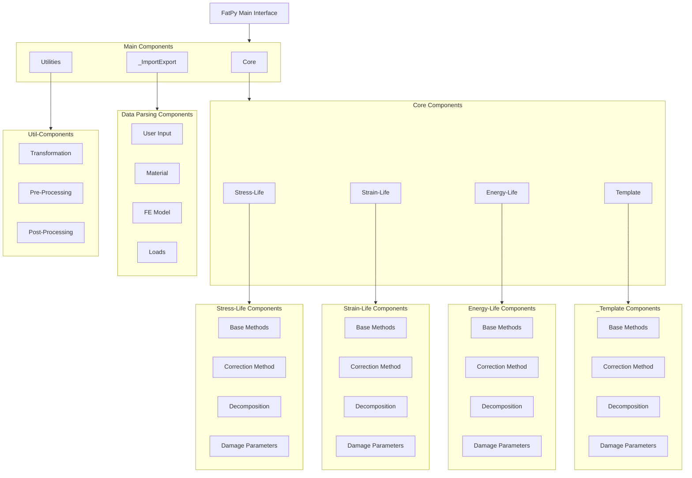

# Core Modules

The core modules of FatPy provide the fundamental analytical methods for fatigue life evaluation.

## Available Modules

- [Core](core/index.md): Methods based on stress-based approaches
- [Data Parsing](data_parsing.md): Tools for parsing and processing data
- [Utilities](utilities.md): Helper functions and utilities for various tasks

## Module Structure

*TO BE IMPLEMENTED*

## Component Diagram

## Theory Reference

For a deeper understanding of the methods and their theoretical background, refer to the [Theory Reference](../theory/index.md).
