# AbstractLLM Architecture

This document provides a detailed overview of the AbstractLLM architecture, design patterns, and component interactions.

## System Architecture Overview

AbstractLLM follows a clean architectural pattern that separates interface definitions from provider-specific implementations. The architecture is designed around the following key principles:

1. **Interface-based Abstraction**: A common interface that all providers must implement
2. **Factory Pattern**: A factory function that creates provider instances
3. **Configuration Management**: A unified configuration system
4. **Capability Inspection**: Dynamic capability discovery
5. **Error Handling and Logging**: Consistent error handling and logging across all providers
6. **Media Handling**: Modular system for processing different media types

The following diagram illustrates the high-level architecture:

```mermaid
classDiagram
    class AbstractLLMInterface {
        <<abstract>>
        -dict config
        +__init__(config: dict)
        +generate(prompt: str, system_prompt: str, stream: bool, **kwargs): str|Generator
        +generate_async(prompt: str, system_prompt: str, stream: bool, **kwargs): str|AsyncGenerator
        +get_capabilities(): dict
        +set_config(**kwargs): void
        +update_config(config: dict): void
        +get_config(): dict
    }
    
    class ModelParameter {
        <<enum>>
        +TEMPERATURE
        +MAX_TOKENS
        +SYSTEM_PROMPT
        +MODEL
        +API_KEY
        +etc...
    }
    
    class ModelCapability {
        <<enum>>
        +STREAMING
        +MAX_TOKENS
        +SYSTEM_PROMPT
        +ASYNC
        +FUNCTION_CALLING
        +VISION
        +etc...
    }
    
    class ConfigurationManager {
        <<static>>
        +create_base_config(**kwargs): dict
        +initialize_provider_config(provider_name: str, config: dict): dict
        +get_param(config: dict, param: ModelParameter, default: Any): Any
        +update_config(config: dict, updates: dict): dict
        +extract_generation_params(provider: str, config: dict, kwargs: dict, system_prompt: str): dict
    }
    
    class OpenAIProvider {
        +__init__(config: dict)
        +generate(prompt: str, **kwargs): str|Generator
        +generate_async(prompt: str, **kwargs): str|AsyncGenerator
        +get_capabilities(): dict
    }
    
    class AnthropicProvider {
        +__init__(config: dict)
        +generate(prompt: str, **kwargs): str|Generator
        +generate_async(prompt: str, **kwargs): str|AsyncGenerator
        +get_capabilities(): dict
    }
    
    class OllamaProvider {
        +__init__(config: dict)
        +generate(prompt: str, **kwargs): str|Generator
        +generate_async(prompt: str, **kwargs): str|AsyncGenerator
        +get_capabilities(): dict
    }
    
    class HuggingFaceProvider {
        -_model
        -_tokenizer
        -_model_cache
        +__init__(config: dict)
        +load_model(): void
        +warmup(): void
        +generate(prompt: str, **kwargs): str|Generator
        +generate_async(prompt: str, **kwargs): str|AsyncGenerator
        +get_capabilities(): dict
    }
    
    class Factory {
        +create_llm(provider: str, **config): AbstractLLMInterface
    }
    
    class LoggingUtils {
        +log_request(provider: str, prompt: str, parameters: dict): void
        +log_response(provider: str, response: str): void
        +setup_logging(level: int): void
    }
    
    class MediaInput {
        <<abstract>>
        +to_provider_format(provider: str): Any
        +media_type(): str
        +metadata(): dict
    }
    
    class ImageInput {
        +source: str|Path
        +detail_level: str
        +to_provider_format(provider: str): Any
        +media_type(): str
        +get_base64(): str
        +get_content(): bytes
    }
    
    class MediaFactory {
        +from_source(source, media_type): MediaInput
        +from_sources(sources, media_type): List[MediaInput]
    }
    
    class MediaProcessor {
        +process_inputs(params: dict, provider: str): dict
    }
    
    AbstractLLMInterface <|-- OpenAIProvider
    AbstractLLMInterface <|-- AnthropicProvider
    AbstractLLMInterface <|-- OllamaProvider
    AbstractLLMInterface <|-- HuggingFaceProvider
    
    AbstractLLMInterface -- ModelParameter
    AbstractLLMInterface -- ModelCapability
    
    Factory ..> AbstractLLMInterface: creates
    Factory ..> OpenAIProvider: creates
    Factory ..> AnthropicProvider: creates
    Factory ..> OllamaProvider: creates
    Factory ..> HuggingFaceProvider: creates
    
    Factory ..> ConfigurationManager: uses
    AbstractLLMInterface ..> ConfigurationManager: uses
    OpenAIProvider ..> ConfigurationManager: uses
    AnthropicProvider ..> ConfigurationManager: uses
    OllamaProvider ..> ConfigurationManager: uses
    HuggingFaceProvider ..> ConfigurationManager: uses
    
    LoggingUtils <.. OpenAIProvider: uses
    LoggingUtils <.. AnthropicProvider: uses
    LoggingUtils <.. OllamaProvider: uses
    LoggingUtils <.. HuggingFaceProvider: uses
    
    MediaInput <|-- ImageInput
    MediaFactory ..> MediaInput: creates
    MediaFactory ..> ImageInput: creates
    MediaProcessor ..> MediaFactory: uses
    
    MediaProcessor <.. OpenAIProvider: uses
    MediaProcessor <.. AnthropicProvider: uses
    MediaProcessor <.. OllamaProvider: uses
    MediaProcessor <.. HuggingFaceProvider: uses
```



## Package Structure

The package is organized into the following directory structure:

```
abstractllm/
├── __init__.py                # Package exports and version
├── interface.py               # Abstract base class and parameter definitions
├── factory.py                 # Factory for creating provider instances
├── providers/
│   ├── __init__.py            # Provider registry
│   ├── openai.py              # OpenAI implementation
│   ├── anthropic.py           # Anthropic implementation
│   ├── ollama.py              # Ollama implementation
│   └── huggingface.py         # Hugging Face implementation
├── media/
│   ├── __init__.py            # Media handling exports
│   ├── interface.py           # MediaInput abstract base class
│   ├── image.py               # ImageInput implementation
│   ├── factory.py             # MediaFactory implementation
│   └── processor.py           # MediaProcessor implementation
├── utils/
│   ├── __init__.py
│   ├── config.py              # Centralized configuration management
│   ├── logging.py             # Logging utilities
│   └── image.py               # Legacy image processing utilities
└── exceptions.py              # Custom exception classes
```

## Data Flow Diagrams

### General Request Flow

The following diagram illustrates the general flow of a generation request through the system:

```mermaid
flowchart TB
    User[User Code] --> Factory["create_llm(provider, **config)"]
    Factory --> ConfigManager["ConfigurationManager.create_base_config()"]
    ConfigManager --> ProviderConfig["ConfigurationManager.initialize_provider_config()"]
    ProviderConfig --> |"create provider instance"| Provider[LLM Provider]
    
    User --> |"prompt, system_prompt, stream, image, images, **kwargs"| Generate["provider.generate()"]
    
    subgraph Generation
        Generate --> ExtractParams["ConfigurationManager.extract_generation_params()"]
        ExtractParams --> CheckImage[Check for media inputs]
        
        CheckImage --> |"if media present"| ProcessMedia[MediaProcessor.process_inputs()]
        CheckImage --> |"if no media"| PrepareRequest
        
        ProcessMedia --> |"Create MediaInput objects"| MediaFactory[MediaFactory.from_source()]
        MediaFactory --> FormatMedia[MediaInput.to_provider_format()]
        FormatMedia --> PrepareRequest[Prepare API request]
        
        PrepareRequest --> LogRequest[Log request]
        
        LogRequest --> |"if stream=True"| StreamRequest[Create streaming request]
        LogRequest --> |"if stream=False"| StandardRequest[Create standard request]
        
        StreamRequest --> |"via generator"| ReturnStreaming[Return response chunks]
        StandardRequest --> ProcessResponse[Process complete response]
        
        ProcessResponse --> LogResponse[Log response]
        LogResponse --> ReturnComplete[Return complete response]
    end
    
    ReturnStreaming --> User
    ReturnComplete --> User
```

### Provider-Specific Vision Flows

The following diagram illustrates how image data flows through the system for vision-capable models:


## Core Components

### AbstractLLMInterface

The core of the package is the `AbstractLLMInterface` abstract base class, which defines the common interface that all provider implementations must follow. It includes:

- Initialization with configuration
- Methods for text generation (sync and async)
- Methods for capability inspection
- Configuration management

### ModelParameter and ModelCapability Enums

The package uses enumerated types to provide type-safe parameter handling:

1. **ModelParameter**: Defines available configuration parameters (temperature, max_tokens, etc.)
2. **ModelCapability**: Defines capabilities that models may support (streaming, vision, etc.)

### ConfigurationManager

The `ConfigurationManager` class provides centralized configuration management through a set of static methods:

1. **Base Configuration Creation**: Creates a configuration dictionary with appropriate defaults
2. **Provider-Specific Initialization**: Applies provider-specific defaults and environment variables
3. **Parameter Extraction**: Extracts and combines parameters for API calls
4. **Parameter Access**: Provides a consistent way to access parameters regardless of key type (enum or string)

This centralized approach eliminates configuration duplication across providers and ensures consistent parameter handling throughout the library.

### Factory Function

The `create_llm` factory function provides a clean way to instantiate the appropriate provider based on the provider name. This allows for a consistent instantiation pattern regardless of the underlying provider.

### Provider Implementations

Each provider implementation (OpenAI, Anthropic, Ollama, HuggingFace) extends the `AbstractLLMInterface` and implements the required methods according to the specific provider's API and requirements.

The HuggingFace provider is unique in that it manages local models rather than making API calls, and includes additional functionality for model loading, caching, and warmup.

## Memory Management

The HuggingFace provider implements a sophisticated model caching mechanism to efficiently manage memory resources:


The cache uses a least-recently-used (LRU) eviction policy to ensure that memory is used efficiently.

## Error Handling

AbstractLLM implements a consistent error handling strategy:

1. Provider-specific errors are caught and wrapped in appropriate exceptions
2. Timeouts are implemented at multiple levels
3. Invalid parameter combinations are detected and reported
4. Network errors are properly handled and reported

## Cross-Provider Compatibility

The architecture is designed to maintain a consistent interface while accommodating provider-specific requirements:

1. Common parameters are mapped to provider-specific formats
2. Provider-specific features are exposed through a consistent interface where possible
3. Capability inspection allows code to adapt to provider capabilities dynamically 