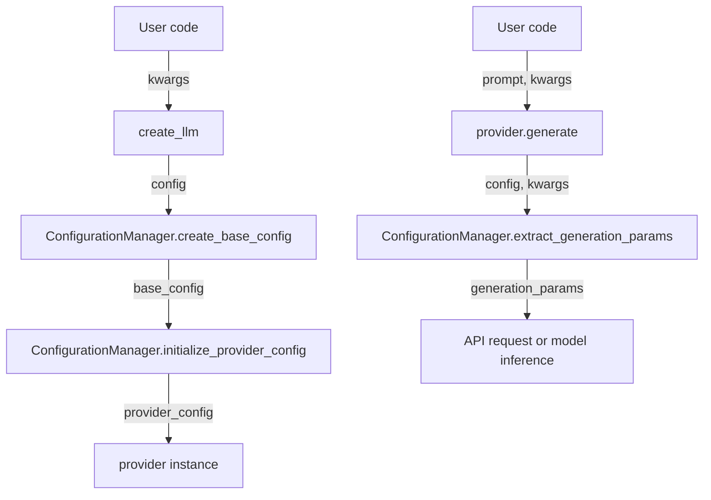

# Configuration Management in AbstractLLM

## Overview

AbstractLLM uses a centralized configuration management system to handle parameters consistently across providers. This system is implemented in the `ConfigurationManager` class in `abstractllm/utils/config.py`.

## Key Features

- Unified parameter handling across all providers
- Support for both enum and string parameter keys
- Default values for common parameters
- Environment variable integration for API keys
- Provider-specific parameter extraction
- Parameter validation and deprecation warnings

## Configuration Flow

1. **Base Configuration**: Default parameters are set in `create_base_config()`
2. **Provider-Specific Initialization**: Provider-specific defaults are applied in `initialize_provider_config()`
3. **Generation Parameters**: For each generation request, parameters are extracted and combined with the base configuration in `extract_generation_params()`



## Using Configuration

### Creating a Provider with Configuration

```python
from abstractllm import create_llm, ModelParameter

# Using enum keys (recommended for type checking)
llm = create_llm("openai", **{
    ModelParameter.TEMPERATURE: 0.7,
    ModelParameter.MAX_TOKENS: 1000,
    ModelParameter.MODEL: "gpt-4o"
})

# Using string keys (more convenient for dynamic configuration)
llm = create_llm("openai", temperature=0.7, max_tokens=1000, model="gpt-4o")
```

### Overriding Configuration for a Single Generate Call

```python
# Base configuration
llm = create_llm("openai", temperature=0.7)

# Override temperature just for this call
response = llm.generate("Hello, world!", temperature=0.9)
```

### Getting and Updating Configuration

```python
# Get current configuration
config = llm.get_config()

# Update configuration
llm.set_config(temperature=0.5, max_tokens=2000)

# Update with a dictionary
llm.update_config({
    ModelParameter.TEMPERATURE: 0.5,
    ModelParameter.MAX_TOKENS: 2000
})
```

## Common Parameters

| Parameter | Type | Default | Description |
|-----------|------|---------|-------------|
| `temperature` | float | 0.7 | Controls randomness in generation |
| `max_tokens` | int | 2048 | Maximum tokens to generate |
| `top_p` | float | 1.0 | Alternative to temperature for nucleus sampling |
| `system_prompt` | str | None | System instruction for the model |
| `model` | str | Provider-specific | Model identifier/name |
| `api_key` | str | From env var | API key for provider authentication |

## Provider-Specific Parameters

Each provider may have additional parameters specific to its implementation:

### OpenAI

- `organization`: Organization ID for API calls
- `image_detail`: Detail level for image analysis in vision models
- `user`: User identifier for request attribution

### HuggingFace

- `device`: Device to run model on (e.g., "cpu", "cuda")
- `load_in_8bit`: Whether to use 8-bit quantization
- `trust_remote_code`: Whether to allow remote code execution
- `cache_dir`: Directory for model caching

### Ollama

- `base_url`: URL of the Ollama service

### Anthropic

- (No major provider-specific parameters currently)

## Environment Variables

The configuration system automatically checks for these environment variables:

- `OPENAI_API_KEY`: API key for OpenAI
- `ANTHROPIC_API_KEY`: API key for Anthropic
- `HUGGINGFACE_API_KEY`: API key for HuggingFace Hub (optional)
- `OLLAMA_BASE_URL`: Base URL for Ollama service (default: http://localhost:11434)

## ConfigurationManager API

### `create_base_config(**kwargs)`

Creates a configuration dictionary with default values and applies any overrides provided in kwargs.

```python
config = ConfigurationManager.create_base_config(temperature=0.5)
```

### `initialize_provider_config(provider_name, config=None)`

Initializes a provider-specific configuration with appropriate defaults.

```python
config = ConfigurationManager.initialize_provider_config("openai", existing_config)
```

### `get_param(config, param, default=None)`

Gets a parameter value from the configuration, supporting both enum and string keys.

```python
temperature = ConfigurationManager.get_param(config, ModelParameter.TEMPERATURE, 0.7)
```

### `update_config(config, updates)`

Updates a configuration dictionary with new values.

```python
new_config = ConfigurationManager.update_config(original_config, updates)
```

### `extract_generation_params(provider, config, kwargs, system_prompt=None)`

Extracts and combines parameters for generation from config and kwargs.

```python
params = ConfigurationManager.extract_generation_params(
    "openai", provider.config, kwargs, system_prompt
)
```

## Configuration Best Practices

1. Use `ModelParameter` enum keys when possible for better type checking
2. Set common configuration when creating the provider
3. Override only specific parameters in generate calls
4. Use environment variables for API keys in development
5. Explicitly pass API keys in production deployments

## Implementation Details

The `ConfigurationManager` class is implemented as a collection of static methods, allowing it to be used without instantiation. This design choice makes it easier to use the configuration utilities throughout the codebase without managing instances.

Parameter extraction includes several key steps:

1. Combining the base configuration with request-specific overrides
2. Handling both enum and string parameter keys
3. Applying provider-specific transformations and defaults
4. Processing special parameters like images for vision requests

This centralized approach ensures consistent parameter handling across all providers and eliminates configuration duplication throughout the codebase. 