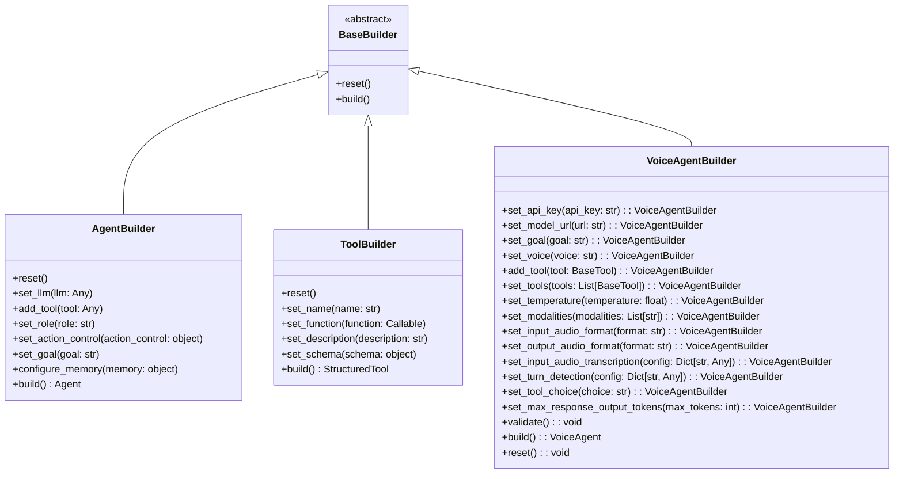
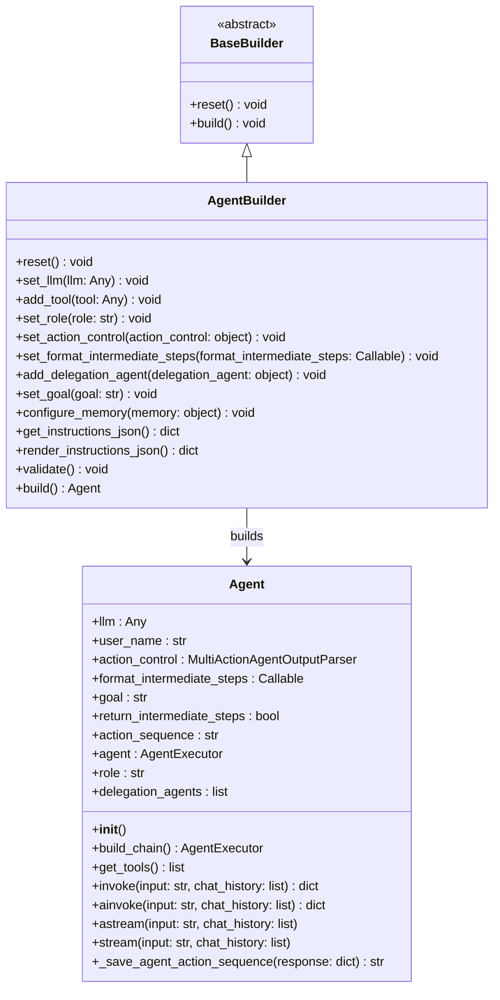

# [](https://recall.space/)

[](https://www.python.org/)
[](https://github.com/psf/black)
[](LICENSE)
[](https://pypi.org/project/agent-builder/)

---

| Environment  | Version |
|-------------|---------|
| Production  | 0.1.1   |
| Development | 0.1.1   |

# 🛠️ **Agent Builder** - Modular AI Agent Framework

The **Agent Builder** package provides a modular framework for constructing autonomous AI agents with ease. It follows a builder pattern for seamless configuration and integrates with **Large Language Models (LLMs)** and various tools to build highly adaptable AI-driven assistants.

## 🚀 **Key Features**

✅ **Builder Pattern:** Construct agents using a structured, modular approach.  
✅ **ToolBuilder:** Define tools with functions, descriptions, and schemas.  
✅ **AgentBuilder:** Configure agents with roles, memory, action control, and delegation.  
✅ **VoiceAgentBuilder:** Create real-time voice-enabled agents via OpenAI's Realtime API.  
✅ **WebSocket Support:** Enables real-time AI interactions over WebSockets.  
✅ **Modular & Extensible:** Easily integrate additional agents, tools, and features.  

---

## 📦 **Installation**

Install the package using pip:

```sh
pip install agent-builder
```
---

## 🏗️ UML Class Design

### **Core Classes**



---
### Builder design pattern



---

## 📖 **Usage Examples**

### **1️⃣ Building a Tool**

```python
from pydantic import BaseModel, Field
from agent_builder.builders.tool_builder import ToolBuilder

class GetTemperatureSchema(BaseModel):
    city: str = Field(description="City for which temperature has to be checked.")

def get_temperature(city: str) -> float:
    return 30.1

# Instantiate and configure the tool builder
tool_builder = ToolBuilder()
tool_builder.set_name("get-temperature-tool")
tool_builder.set_function(get_temperature)
tool_builder.set_description("Tool to get temperature of given city")
tool_builder.set_schema(GetTemperatureSchema)

get_temperature_tool = tool_builder.build()
```

### **2️⃣ Building an Agent**

```python
from agent_builder.builders.agent_builder import AgentBuilder
from langchain_openai import ChatOpenAI

llm = ChatOpenAI(model="gpt-4o", api_key="OPENAI_KEY", base_url="https://api.openai.com/v1")

agent_builder = AgentBuilder()
agent_builder.set_goal("You are a customer service representative at a weather forecast agency.")
agent_builder.set_llm(llm)
agent_builder.add_tool(get_temperature_tool)

agent = agent_builder.build()
response = agent.invoke(input="What is the current temperature in Pune?", chat_history=[])
```

---
## 🎤 Voice Agent Builder

The `VoiceAgentBuilder` allows the creation of AI-powered voice assistants capable of real-time voice interactions using OpenAI's Realtime API. It works seamlessly with Azure OpenAI as well.

### **Example: Building a Voice Agent**

```python
import os
from dotenv import load_dotenv
from agent_builder.builders.voice_agent_builder import VoiceAgentBuilder

load_dotenv()

AZURE_GPT4O_REALTIME_PREVIEW_URL = os.getenv("AZURE_GPT4O_REALTIME_PREVIEW_URL")
AZURE_GPT4O_REALTIME_PREVIEW_KEY = os.getenv("AZURE_GPT4O_REALTIME_PREVIEW_KEY")

INSTRUCTIONS = """
You are Lisa, an intelligent material planning assistant.
Assist users in planning and managing resources efficiently.
"""

builder = (
    VoiceAgentBuilder()
    .set_api_key(AZURE_GPT4O_REALTIME_PREVIEW_KEY)
    .set_model_url(AZURE_GPT4O_REALTIME_PREVIEW_URL)
    .set_goal(INSTRUCTIONS)
)

voice_agent = builder.build()
```

---

##  Real-Time Voice Agent testing locally
```python

"""
Script to test the VoiceAgent using microphone input and speaker output.

This script initializes a VoiceAgent instance and allows users to interact with it via speech.
All audio-related operations (input/output handling) are abstracted away.

Requirements:
    pip install pyaudio python-dotenv

"""

import asyncio
import logging
import os
from dotenv import load_dotenv
from agent_builder.builders.voice_agent_builder import VoiceAgentBuilder
from agent_builder.utils.audio_utils import AudioHandler

load_dotenv()

# API Configuration
AZURE_GPT4O_REALTIME_PREVIEW_URL = os.getenv("AZURE_GPT4O_REALTIME_PREVIEW_URL")
AZURE_GPT4O_REALTIME_PREVIEW_KEY = os.getenv("AZURE_GPT4O_REALTIME_PREVIEW_KEY")

INSTRUCTIONS = """
You are an assistant
"""

# User-defined audio parameters (can be modified)
FRAME_SIZE = 3200  # Adjust for lower latency if needed
RATE = 24000  # Sampling rate in Hz
CHANNELS = 1  # 1 = Mono, 2 = Stereo


async def main():
    # Logging Setup
    logging.basicConfig(level=logging.INFO)
    logger = logging.getLogger(__name__)

    # Build the VoiceAgent
    builder = (
        VoiceAgentBuilder()
        .set_api_key(AZURE_GPT4O_REALTIME_PREVIEW_KEY)
        .set_model_url(AZURE_GPT4O_REALTIME_PREVIEW_URL)
        .set_goal(INSTRUCTIONS)
    )
    voice_agent = builder.build()

    # Initialize Audio Handler
    audio_handler = AudioHandler(frame_size=FRAME_SIZE, rate=RATE, channels=CHANNELS)

    print("VoiceAgent is ready. Start speaking. Press Ctrl+C to stop.")

    # Start audio playback and input tasks
    playback_task = asyncio.create_task(audio_handler.play_audio())
    input_task = asyncio.create_task(
        voice_agent.ainvoke(
            audio_handler.audio_input_generator(), audio_handler.output_handler
        )
    )

    try:
        await input_task
    except Exception as e:
        logger.error(f"Error during agent interaction: {e}")
    finally:
        playback_task.cancel()
        await playback_task
        audio_handler.close()


if __name__ == "__main__":
    asyncio.run(main())

```


---
## 🌍 Real-Time Voice Agent with WebSockets

This WebSocket-based architecture enables real-time voice interactions between users and AI.

### **WebSocket Server Implementation (FastAPI)**

```python
from fastapi import FastAPI, WebSocket, WebSocketDisconnect
import json
import logging
from agent_builder.builders.voice_agent_builder import VoiceAgentBuilder
from app.utils.websocket_stream import websocket_stream

app = FastAPI()
logger = logging.getLogger(__name__)

AZURE_GPT4O_REALTIME_PREVIEW_URL = "your_openai_api_url"
AZURE_GPT4O_REALTIME_PREVIEW_KEY = "your_openai_api_key"
INSTRUCTIONS = "Your AI assistant instructions here."

@app.websocket("/voice-agent")
async def voice_agent_endpoint(websocket: WebSocket):
    await websocket.accept()
    try:
        browser_receive_stream = websocket_stream(websocket)
        builder = (
            VoiceAgentBuilder()
            .set_api_key(AZURE_GPT4O_REALTIME_PREVIEW_KEY)
            .set_model_url(AZURE_GPT4O_REALTIME_PREVIEW_URL)
            .set_goal(INSTRUCTIONS)
        )
        voice_agent = builder.build()
        await voice_agent.ainvoke(browser_receive_stream, websocket.send_text)
    except WebSocketDisconnect:
        logger.info("Client disconnected")
    except Exception as e:
        logger.error(f"Error: {e}")
        await websocket.close(code=1001, reason="Internal server error")
```

### **Client-Side WebSocket Example (JavaScript)**

```javascript
const socket = new WebSocket("ws://localhost:8000/voice-agent");

socket.onopen = () => console.log("Connected to WebSocket");

function sendAudio(base64Audio) {
    socket.send(JSON.stringify({ type: "input_audio_buffer.append", audio: base64Audio }));
}

function commitAudio() {
    socket.send(JSON.stringify({ type: "input_audio_buffer.commit" }));
}

socket.onmessage = (event) => {
    const data = JSON.parse(event.data);
    if (data.type === "response.audio.delta") {
        console.log("Received audio delta:", data.delta);
    }
};

socket.onclose = (event) => console.log("WebSocket closed: ", event.reason);
```

---

## 📡 WebSocket Payloads

### **Client Sends:**

```json
{
    "type": "input_audio_buffer.append",
    "audio": "Base64EncodedAudioData"
}
```

```json
{
    "type": "input_audio_buffer.commit"
}
```

### **Server Responds:**

```json
{
    "type": "response.audio.delta",
    "delta": "Base64EncodedAudioDelta"
}
```

```json
{
    "type": "error",
    "error": { "message": "Error message", "code": "error_code" }
}
```

---

## **Conclusion**

This WebSocket setup enables real-time voice interactions between users and Lisa AI. The architecture ensures low-latency communication and efficient speech processing. Clients can integrate this into web applications using JavaScript, React, or other frontend technologies.

---
## 🤝 Contributing

1. Fork the repository.
2. Create a new branch (`git checkout -b feature/your-feature`).
3. Commit your changes (`git commit -am 'Add a feature'`).
4. Push to the branch (`git push origin feature/your-feature`).
5. Create a Pull Request.

---

## 📜 License
This project is licensed under the MIT License. See `LICENSE` for details.

---

Happy Building! 🚀
