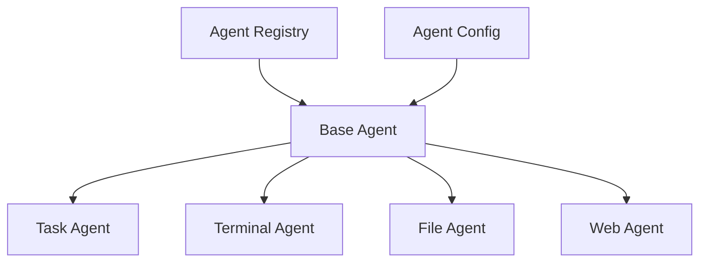
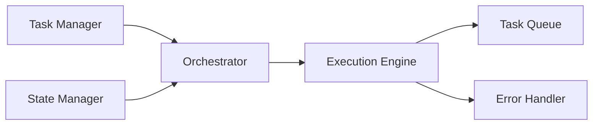

# Agentic Kernel System Architecture

## Overview

Agentic Kernel is a sophisticated multi-agent system designed for autonomous task execution and orchestration. The system employs a modular architecture that enables flexible agent interactions, secure execution environments, and robust workflow management.

## Core Components

### 1. Agent System



The agent system provides:

- Modular agent architecture with specialized capabilities
- Dynamic agent registration and discovery
- Configurable agent behaviors
- Secure inter-agent communication
- Resource management and optimization

### 2. Workflow Engine



Features:

- Intelligent task decomposition and allocation
- Real-time progress tracking
- Sophisticated error handling and recovery
- Concurrent execution support
- Performance metrics collection

### 3. Communication Protocol

Standard message format:

```json
{
    "message_id": "uuid",
    "sender": "agent_id",
    "receiver": "agent_id",
    "message_type": "task|status|control",
    "content": {},
    "metadata": {
        "timestamp": "iso8601",
        "priority": "number",
        "tags": ["array"]
    }
}
```

## Security Model

- Isolated execution environments
- Role-based access control
- Encrypted agent communication
- Resource quotas and limits
- Audit logging

## Monitoring and Observability

The system tracks:

- Agent performance metrics
- Resource utilization
- Task completion rates
- System health indicators
- Error rates and patterns

## Extension Points

1. Custom Agents
   - Pluggable agent interfaces
   - Custom capability implementation
   - Configuration management

2. Workflow Templates
   - Reusable workflow patterns
   - Custom execution strategies
   - Resource optimization rules

3. Integration Points
   - External service connectors
   - Custom metric collectors
   - Plugin architecture

## Future Enhancements

- Enhanced AI capabilities
- Advanced workflow optimization
- Improved resource scheduling
- Extended monitoring capabilities
- Additional security features 