# Agent Interaction Patterns

## Introduction

This document provides architecture diagrams and explanations of agent interaction patterns in the Agentic Kernel
system. These patterns illustrate how agents communicate and collaborate to accomplish complex tasks using the A2A
protocol.

## Table of Contents

1. [Basic Interaction Patterns](#basic-interaction-patterns)
2. [Workflow Execution Patterns](#workflow-execution-patterns)
3. [Error Handling Patterns](#error-handling-patterns)
4. [Streaming and Push Notification Patterns](#streaming-and-push-notification-patterns)
5. [Agent Discovery and Capability Negotiation](#agent-discovery-and-capability-negotiation)
6. [Multi-Agent Collaboration Patterns](#multi-agent-collaboration-patterns)

## Basic Interaction Patterns

### Request-Response Pattern

The simplest interaction pattern is the request-response pattern, where one agent sends a request to another agent and
receives a response.

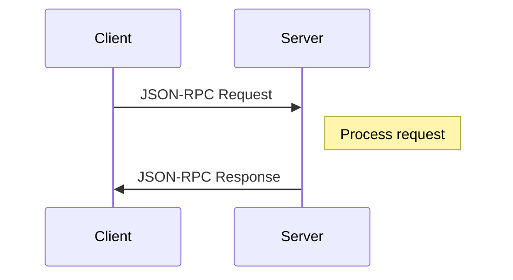

### Task Assignment Pattern

The task assignment pattern is used when one agent assigns a task to another agent.

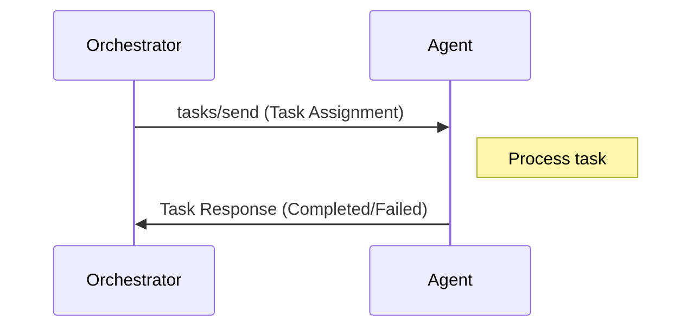

### Query-Response Pattern

The query-response pattern is used when one agent needs information from another agent.

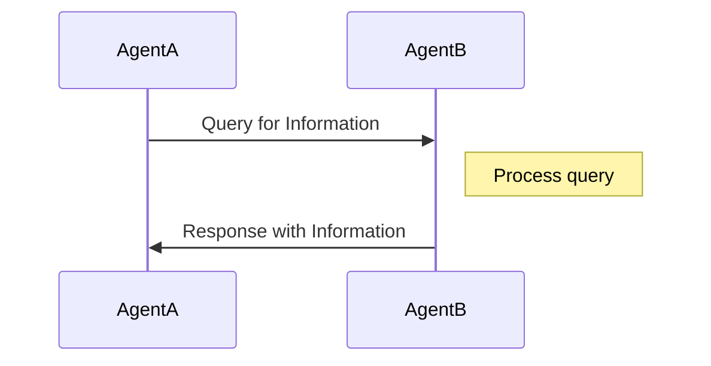

## Workflow Execution Patterns

### Sequential Task Execution

In sequential task execution, tasks are executed one after another, with each task depending on the completion of the
previous task.

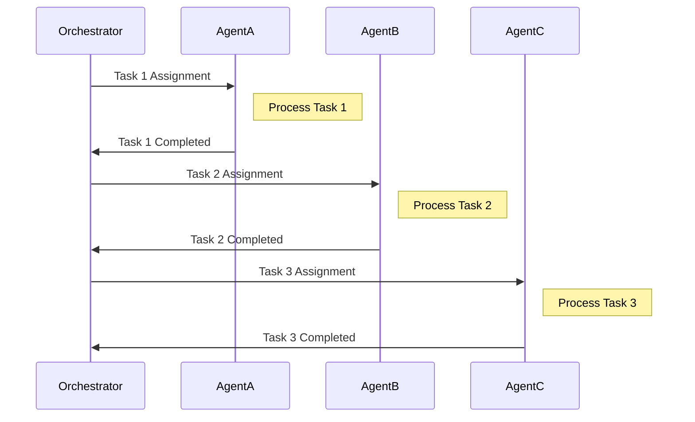

### Parallel Task Execution

In parallel task execution, multiple tasks are executed simultaneously by different agents.

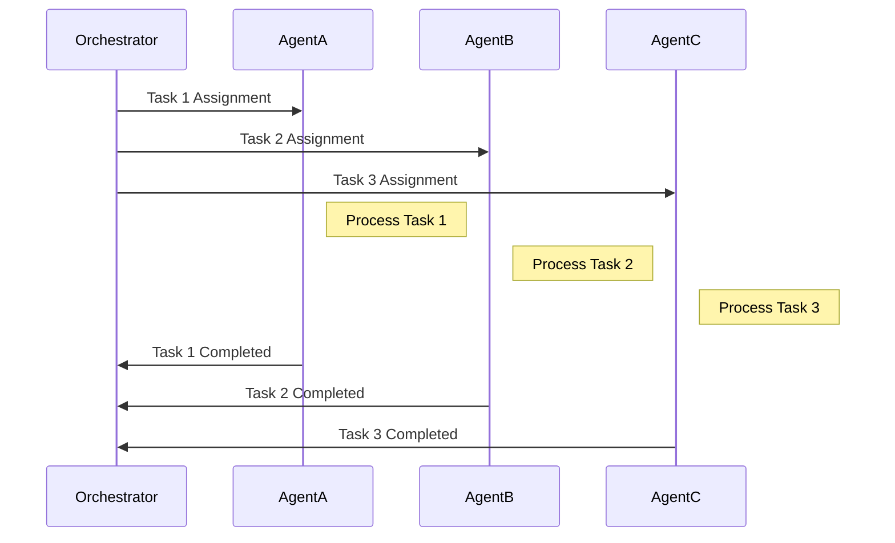

### Dependency-Based Task Execution

In dependency-based task execution, tasks are executed based on their dependencies, with some tasks running in parallel
and others sequentially.

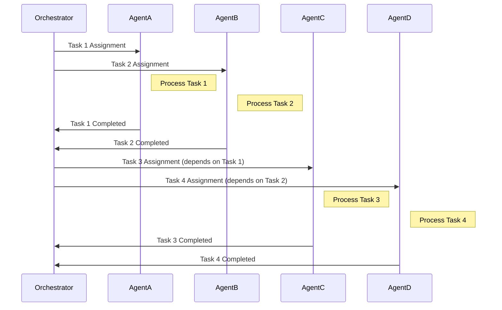

## Error Handling Patterns

### Retry Pattern

The retry pattern is used when a task fails and needs to be retried.

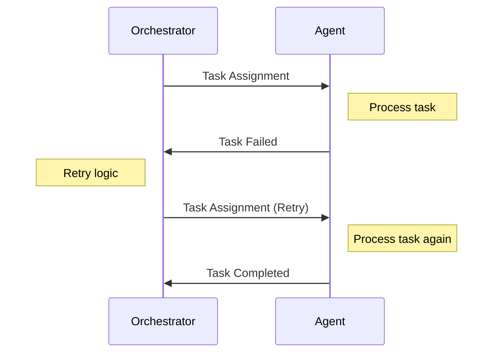

### Fallback Pattern

The fallback pattern is used when a task fails and an alternative approach is needed.

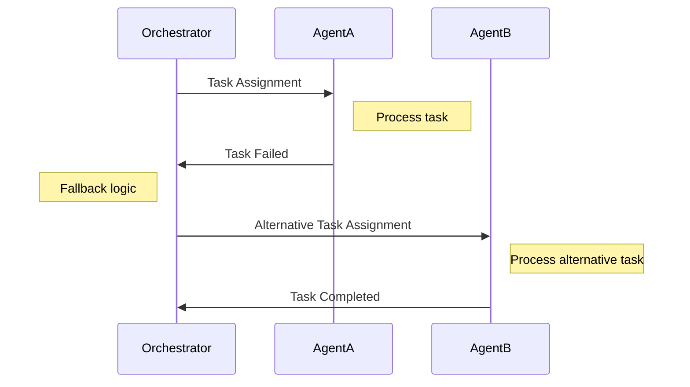

### Error Recovery Pattern

The error recovery pattern is used when a task fails and requires intervention from another agent to recover.

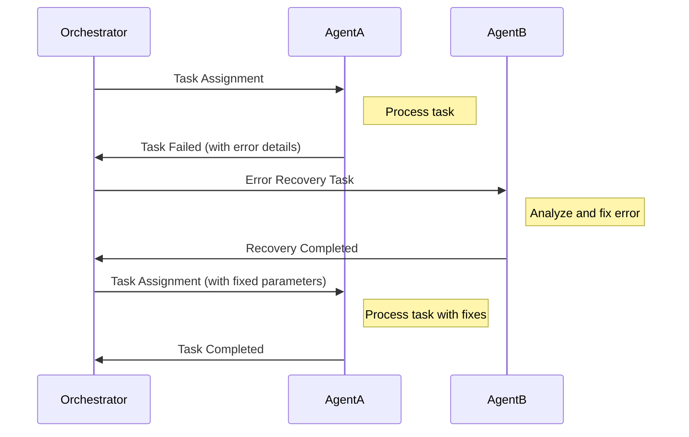

## Streaming and Push Notification Patterns

### Streaming Updates Pattern

The streaming updates pattern is used for long-running tasks where the agent provides incremental updates to the client.

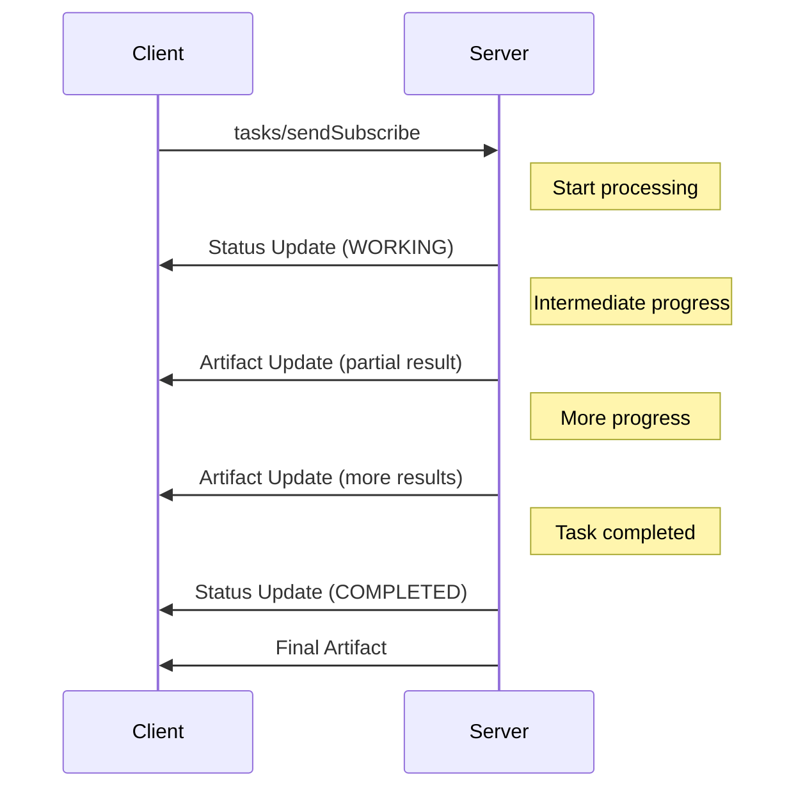

### Push Notification Pattern

The push notification pattern is used when an agent needs to notify a client of asynchronous events.

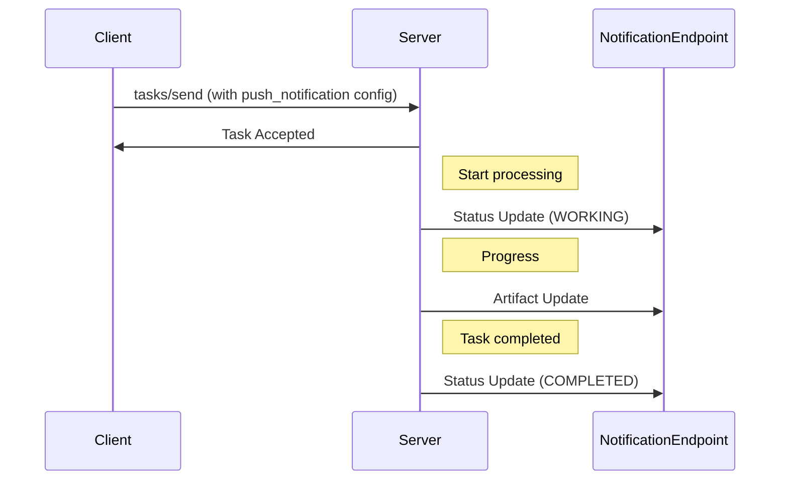

## Agent Discovery and Capability Negotiation

### Agent Discovery Pattern

The agent discovery pattern is used when a client needs to discover the capabilities of an agent.

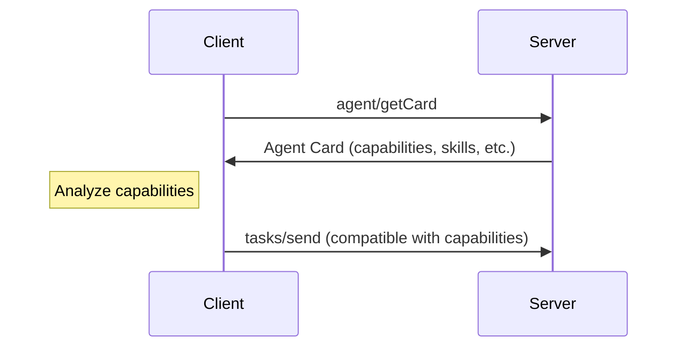

### Capability Negotiation Pattern

The capability negotiation pattern is used when agents need to negotiate how they will interact.

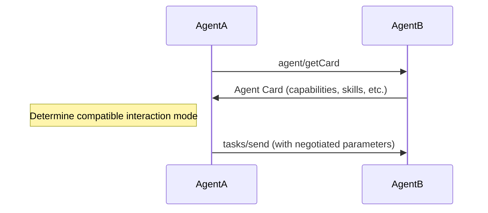

## Multi-Agent Collaboration Patterns

### Team Collaboration Pattern

The team collaboration pattern involves multiple agents working together as a team, coordinated by an orchestrator.

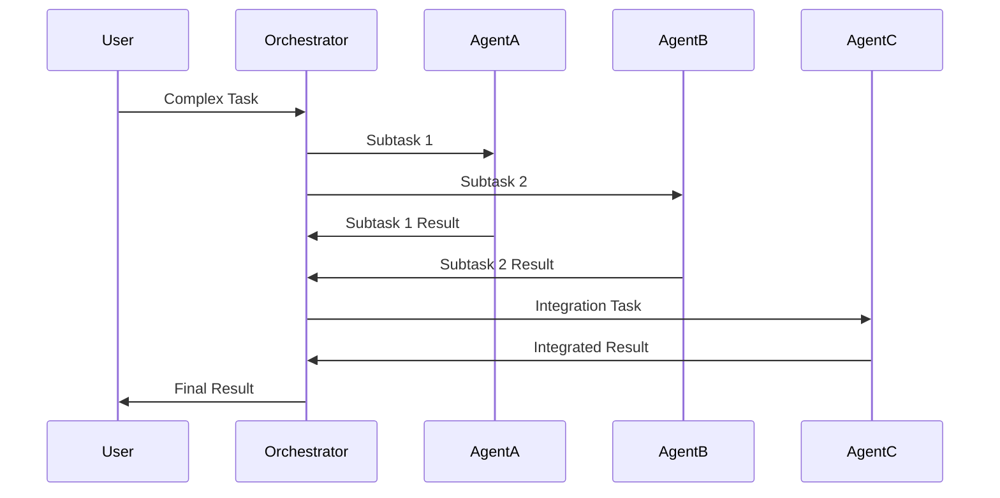

### Peer-to-Peer Collaboration Pattern

The peer-to-peer collaboration pattern involves agents communicating directly with each other without a central
orchestrator.

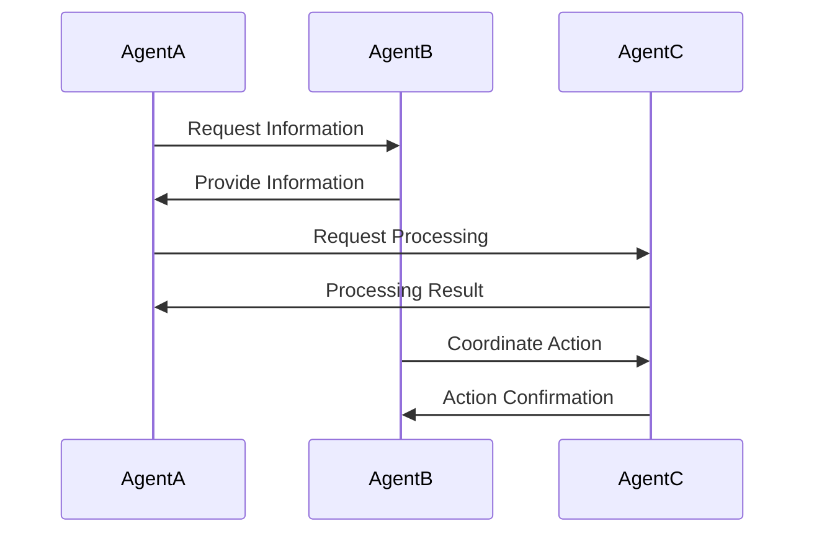

### Consensus-Based Collaboration Pattern

The consensus-based collaboration pattern involves agents reaching consensus on a decision or action.

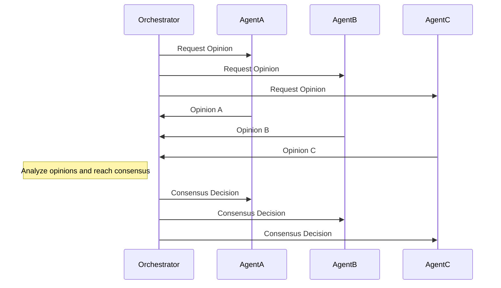

These interaction patterns provide a foundation for understanding how agents communicate and collaborate in the Agentic
Kernel system. By combining these patterns, complex workflows can be created to solve a wide range of problems.