# 🌀 bluer-sandbox

🌀 A sandbox for ideas and experiments.

```bash
pip install bluer-sandbox
```

```mermaid
graph LR

    notebooks_build["@notebooks<br>build<br>&lt;notebook-name&gt;"]

    notebooks_code["@notebooks<br>code<br>&lt;notebook-name&gt;"]
    
    notebooks_connect["@notebooks<br>connect<br>ip=&lt;ip-address&gt;"]

    notebooks_create["@notebooks<br>create<br>&lt;notebook-name&gt;"]

    notebooks_host["@notebooks<br>host"]

    notebooks_open["@notebooks<br>open<br>&lt;notebook-name&gt;"]

    notebook["📘 notebook"]:::folder
    ip_address["🛜 <ip-address>"]:::folder

    notebook --> notebooks_build

    notebook --> notebooks_code

    ip_address --> notebooks_connect

    notebooks_host --> ip_address

    notebooks_create --> notebook

    notebook --> notebooks_open
```




---

> 🌀 [`blue-sandbox`](https://github.com/kamangir/blue-sandbox) for the [Global South](https://github.com/kamangir/bluer-south).

---


[](https://github.com/kamangir/bluer-sandbox/actions/workflows/pylint.yml) [](https://github.com/kamangir/bluer-sandbox/actions/workflows/pytest.yml) [](https://github.com/kamangir/bluer-sandbox/actions/workflows/bashtest.yml) [](https://pypi.org/project/bluer-sandbox/) [](https://pypistats.org/packages/bluer-sandbox)

built by 🌀 [`bluer_options-5.53.1`](https://github.com/kamangir/awesome-bash-cli), based on 🌀 [`bluer_sandbox-5.17.1`](https://github.com/kamangir/bluer-sandbox).
