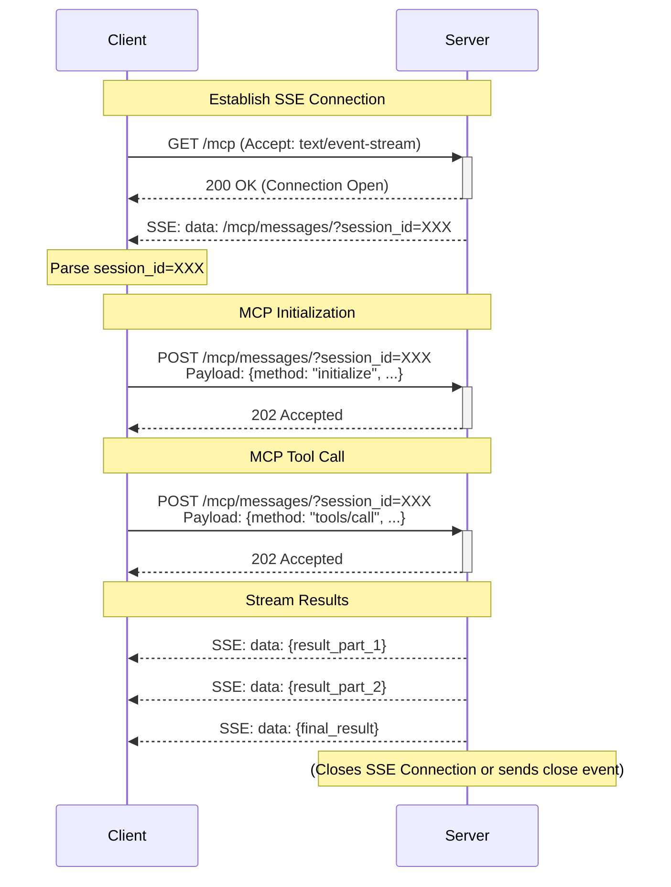

# FastAPI MCP Client

A specialized client library specifically designed to work with [fastapi-mcp](https://github.com/tadata-org/fastapi_mcp) servers that implement the Model Context Protocol (MCP) over Server-Sent Events (SSE). This library provides a seamless way to interact with MCP-enabled FastAPI services.

## Installation

```bash
# Install with pip
pip install fastapi-mcp-client

# Or with UV
uv add fastapi-mcp-client
```

## Quick Start

```python
import asyncio
from fastapi_mcp_client import MCPClient

async def main():
    async with MCPClient("http://localhost:8000") as client:
        # Call a non-streaming operation
        result = await client.call_operation("echo", {"message": "Hello, MCP!"})
        print(f"Echo result: {result}")
        
        # Call a streaming operation with SSE
        stream = await client.call_operation(
            "generate_numbers", 
            {"count": 5},
            stream=True
        )
        
        async for event in stream:
            print(f"Event: {event}")

asyncio.run(main())
```

## Features

- **MCP Protocol Support**: Full implementation of the Model Context Protocol
- **SSE Streaming**: First-class support for Server-Sent Events (SSE) streaming
- **Async-First Design**: Fully async-compatible for high-performance applications
- **Seamless Session Management**: Handles MCP session establishment and message passing
- **Error Handling**: Comprehensive error handling with fallback mechanisms
- **Type Annotations**: Full type hints for better IDE integration and validation

## Running Examples

The repository includes examples to help you get started. Here's how to run them:

### 1. Clone the Repository

```bash
git clone https://github.com/your-username/fastapi-mcp-client.git
cd fastapi-mcp-client
```

### 2. Set Up Environment

```bash
# Create and activate virtual environment
uv venv
source .venv/bin/activate  # On Windows: .venv\Scripts\activate

# Install all dependencies including examples
uv sync --all-extras
```

### 3. Start the Example Server

```bash
# In one terminal
cd examples/server
python simpler_server.py
```

This starts a FastAPI server with several MCP-enabled endpoints:
- `echo`: Returns the message you send
- `generate_numbers`: Streams a sequence of numbers
- `search_documents`: Simulates a document search with streaming results
- `calculate`: Evaluates a simple math expression

### 4. Run the SSE Client Example

```bash
# In another terminal (with virtual env activated)
cd examples
python sse_example.py
```

## Advanced Usage

### Custom Client Configuration

```python
from fastapi_mcp_client import MCPClient, MCPClientConfig

config = MCPClientConfig(
    base_url="http://localhost:8000",
    timeout=60.0,
    log_level="DEBUG"
)

async with MCPClient("http://localhost:8000", config=config) as client:
    # Call a streaming tool with custom configuration
    stream = await client.call_operation(
        "generate_numbers", 
        {"count": 10},
        stream=True
    )
    
    async for event in stream:
        print(f"Received event: {event}")
```

### Understanding the MCP/SSE Flow



## Examples

Check out the [examples](examples/) directory for more:

- [Server Example](examples/server/simple_server.py): A sample FastAPI MCP server
- [SSE Example](examples/sse_example.py): Advanced streaming with custom configuration

## Contributing

Contributions are welcome! Please feel free to submit a Pull Request.

### Development Setup

1. Clone the repository
   ```bash
   git clone https://github.com/your-username/fastapi-mcp-client.git
   cd fastapi-mcp-client
   ```

2. Install [uv](https://github.com/astral-sh/uv)
   ```bash
   curl -LsSf https://astral.sh/uv/install.sh | sh
   ```

3. Create and activate a virtual environment
   ```bash
   uv venv
   source .venv/bin/activate  # On Windows: .venv\Scripts\activate
   ```

4. Install development dependencies
   ```bash
   uv sync --all-extras
   ```

5. Run tests
   ```bash
   pytest
   ```

### Pull Request Process

1. Create your feature branch (`git checkout -b feature/amazing-feature`)
2. Make your changes and ensure tests pass
3. Commit your changes (`git commit -m 'Add some amazing feature'`)
4. Push to the branch (`git push origin feature/amazing-feature`)
5. Open a Pull Request

## License

This project is licensed under the MIT License - see the [LICENSE](LICENSE) file for details.

## Acknowledgments

- Built to work with [FastAPI MCP](https://github.com/tadata-org/fastapi_mcp) - a FastAPI extension for adding MCP support to your APIs
