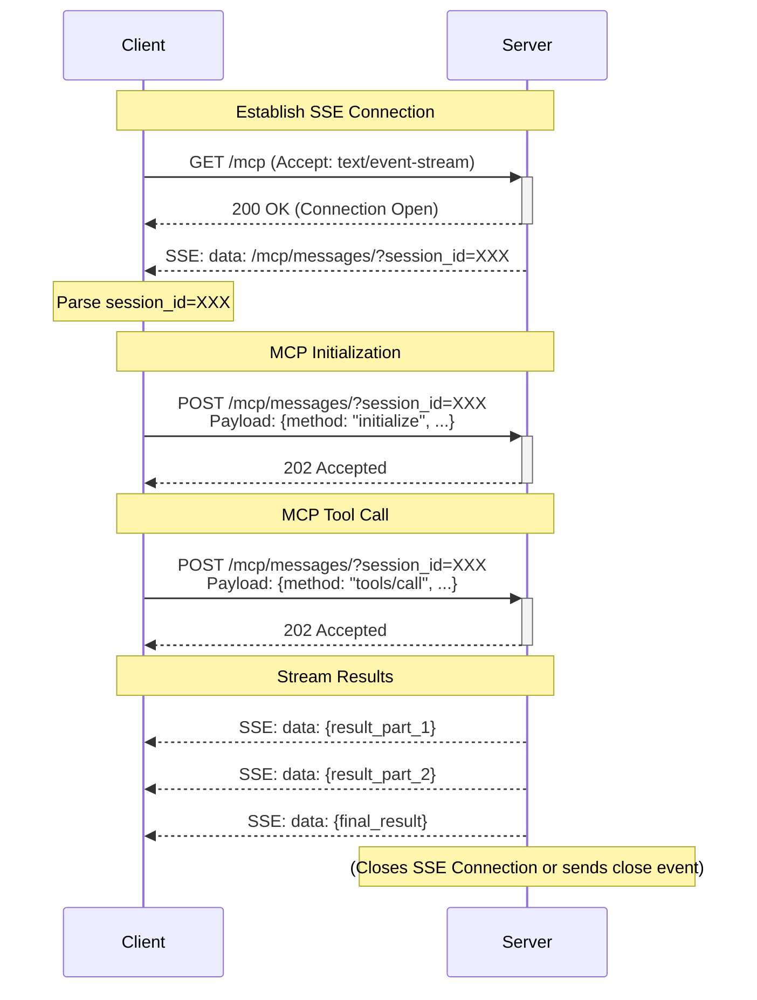

# FastAPI MCP Client

A specialized client library specifically designed to work with [fastapi-mcp](https://github.com/tadata-org/fastapi_mcp) servers that implement the Model Context Protocol (MCP) over Server-Sent Events (SSE). This library provides a seamless way to interact with MCP-enabled FastAPI services.

## Installation

```bash
# Install with pip
pip install fastapi-mcp-client

# Or with UV (recommended)
uv add fastapi-mcp-client
```

## Quick Start

```python
import asyncio
from fastapi_mcp_client import MCPClient

async def main():
    async with MCPClient("http://localhost:8000") as client:
        # Call a non-streaming operation
        result = await client.call_operation("echo", {"message": "Hello, MCP!"})
        print(f"Echo result: {result}")
        
        # Call a streaming operation with SSE
        stream = await client.call_operation(
            "generate_numbers", 
            {"count": 5},
            stream=True
        )
        
        async for event in stream:
            print(f"Event: {event}")

asyncio.run(main())
```

## Features

- **MCP Protocol Support**: Full implementation of the Model Context Protocol
- **SSE Streaming**: First-class support for Server-Sent Events (SSE) streaming
- **Async-First Design**: Fully async-compatible for high-performance applications
- **Seamless Session Management**: Handles MCP session establishment and message passing
- **Error Handling**: Comprehensive error handling with fallback mechanisms
- **Type Annotations**: Full type hints for better IDE integration and validation

## Understanding the MCP/SSE Flow



## Next Steps

- Check out the provided examples in the [repository](https://github.com/your-username/fastapi-mcp-client/tree/main/examples)
- Explore custom client configuration options
- Learn about advanced streaming techniques

## Contributing

Contributions are welcome! Please feel free to submit a Pull Request.

## License

This project is licensed under the MIT License - see the [LICENSE](https://github.com/your-username/fastapi-mcp-client/blob/main/LICENSE) file for details. 