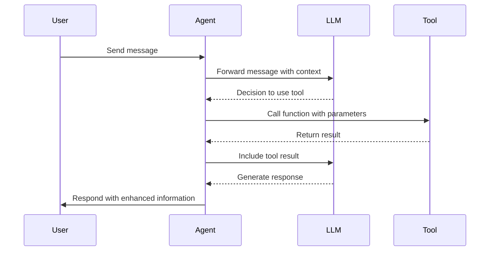
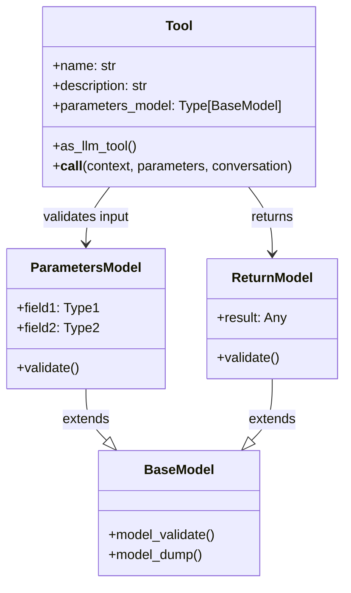
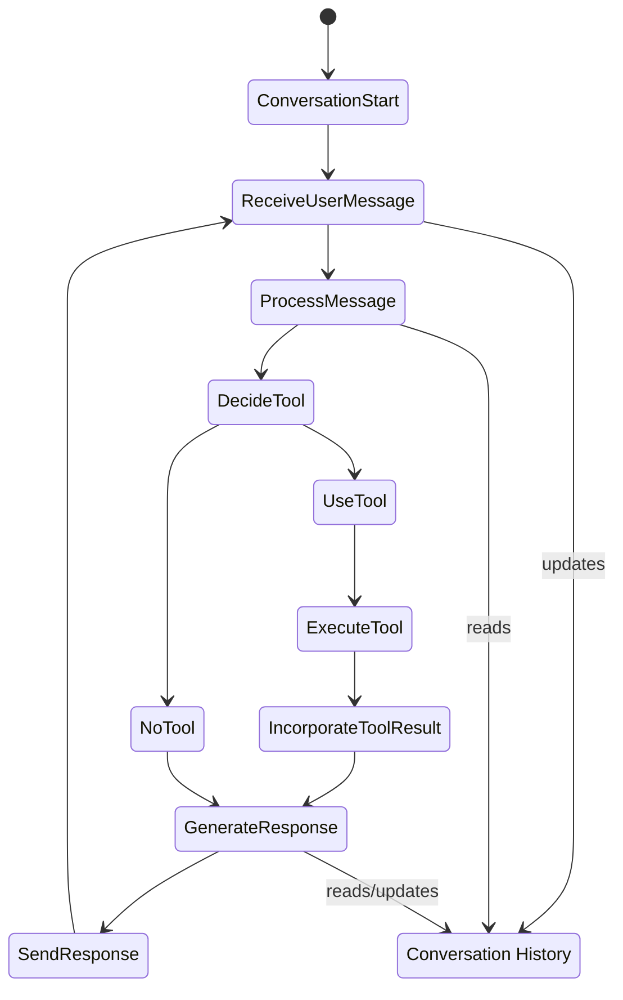
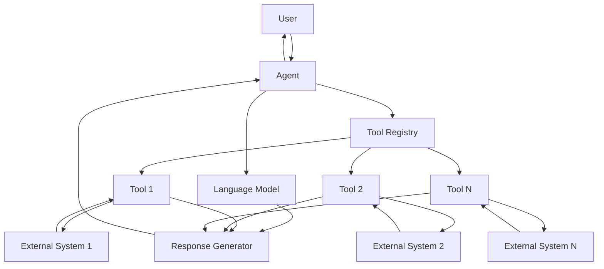
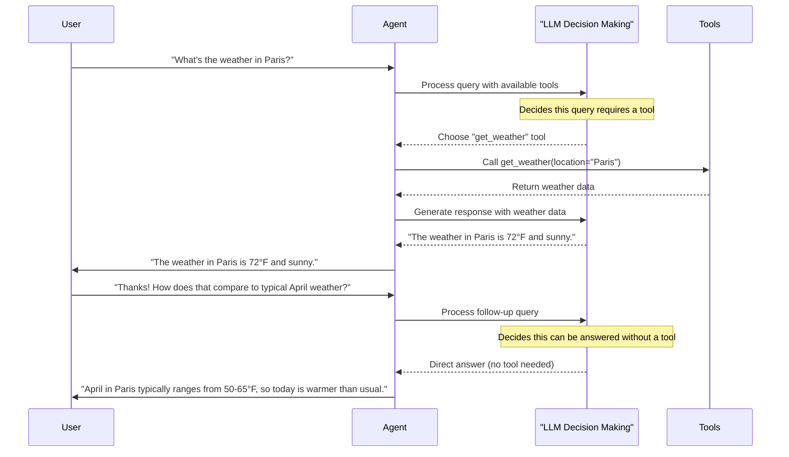

# Frizz

A tool-assisted AI conversationalist framework for Python.

## Overview

Frizz provides a lightweight framework for creating AI agents that can use tools to assist in conversations. It enables:

1. Creating AI assistants that can call functions during conversations
2. Defining custom tools with typed parameters and validation
3. Managing conversation state and context across interactions
4. Structured communication between LLMs and external systems
5. Tool-assisted responses where the AI decides when to use tools

### 1. Creating AI assistants that can call functions during conversations



### 2. Defining custom tools with typed parameters and validation



### 3. Managing conversation state and context across interactions



### 4. Structured communication between LLMs and external systems



### 5. Tool-assisted responses where the AI decides when to use tools



## Installation

```bash
pip install frizz
```

## Requirements

- Python e 3.12

## Core Concepts

### Agent

The `Agent` class manages conversations with language models and facilitates the use of tools in response to user queries. It handles the workflow of receiving user input, generating AI responses, and executing tool calls when appropriate.

### Tools

Tools are functions that provide specific functionality to the agent. Each tool:
- Has a name and description
- Accepts typed parameters (using Pydantic models)
- Returns structured data (also using Pydantic models)
- Can access a shared context object

### Usage Example

```python
from pydantic import BaseModel
from aikernel import Conversation, LLMUserMessage, LLMSystemMessage
from frizz import Agent, tool

# Define parameter and return models
class WeatherParams(BaseModel):
    location: str

class WeatherResult(BaseModel):
    temperature: float
    description: str

# Define a context type
class MyContext:
    def __init__(self, api_key: str):
        self.api_key = api_key

# Create a tool
@tool(name="get_weather")
async def get_weather(*, context: MyContext, parameters: WeatherParams, conversation: Conversation) -> WeatherResult:
    """Get the current weather for a location."""
    # Implementation using context.api_key to call a weather API
    return WeatherResult(temperature=72.5, description="Sunny")

# Create an agent with the tool
agent = Agent(
    tools=[get_weather],
    context=MyContext(api_key="your-api-key"),
    system_message=LLMSystemMessage(content="You are a helpful assistant.")
)

# Process a user message
from aikernel import LLMRouter, LLMModelAlias
user_message = LLMUserMessage(content="What's the weather in San Francisco?")
result = await agent.step(
    user_message=user_message,
    model="claude-3-sonnet-20240229",
    router=LLMRouter()
)
```

## License

[License information]