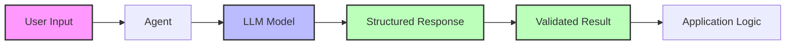
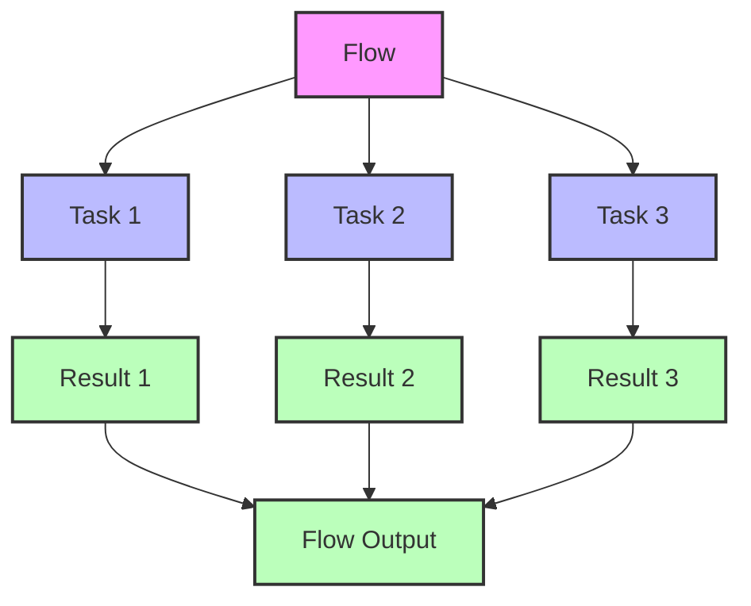
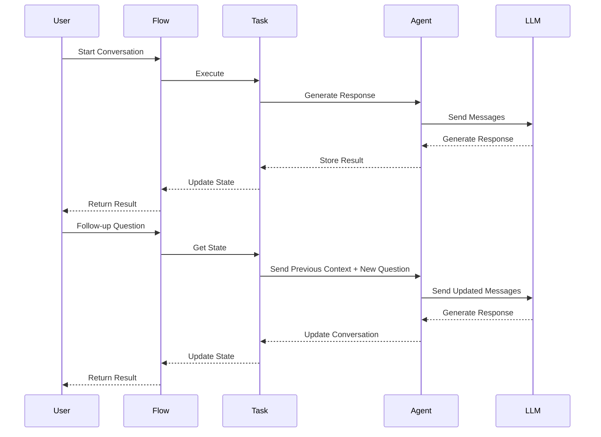
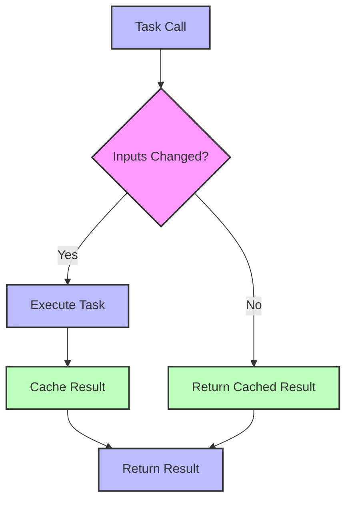
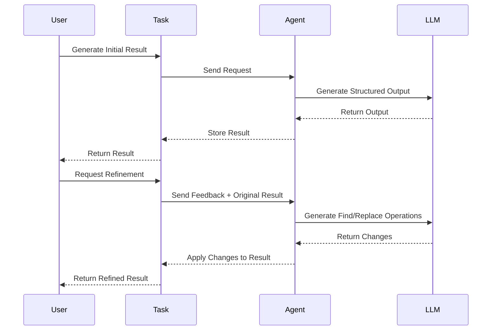
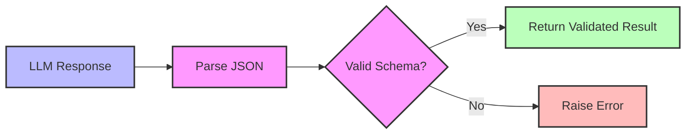
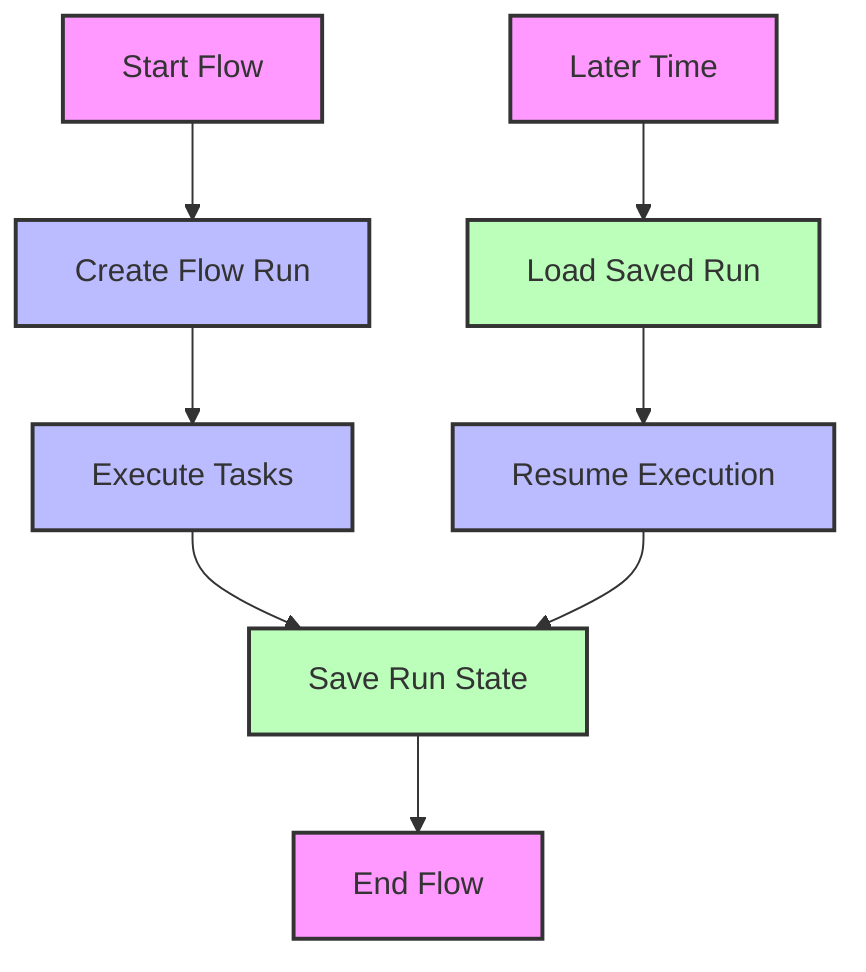
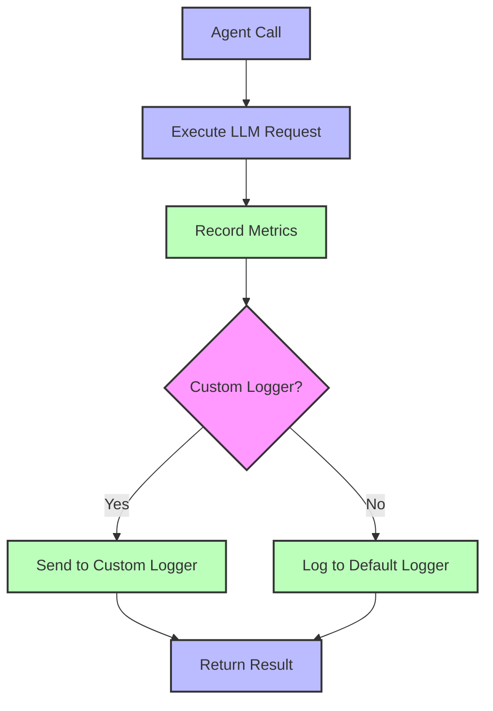

# Goose

Goose is a framework for building LLM-based agents and workflows with strong typing and state management. Here's what's fundamentally possible:

1. Structured LLM interactions - Organize model calls with typed inputs/outputs
2. Task orchestration - Create reusable tasks that can be composed into flows
3. Stateful conversations - Maintain conversation history and model outputs
4. Result caching - Avoid redundant computation based on input hashing
5. Iterative refinement - Enhance results through progressive feedback loops
6. Result validation - Ensure model outputs conform to expected schemas
7. Run persistence - Save and reload workflow executions
8. Custom logging - Track telemetry and performance metrics

It enables building reliable, maintainable AI applications with proper error handling, state tracking, and flow control while ensuring type safety throughout.

## Key Features

### Structured LLM Interactions

Organize model calls with typed inputs and outputs using Pydantic models. This ensures that responses from language models conform to expected structures.



### Task Orchestration

Create reusable tasks that can be composed into flows. Tasks are decorated functions that handle specific operations, while flows coordinate multiple tasks.



### Stateful Conversations

Maintain conversation history and model outputs across multiple interactions. The framework tracks the state of each task in a flow.



### Result Caching

Avoid redundant computation by caching results based on input hashing. The framework automatically detects when inputs change and only regenerates results when necessary.



### Iterative Refinement

Enhance results through progressive feedback loops. The framework supports asking follow-up questions about results and refining them based on feedback.



### Result Validation

Ensure model outputs conform to expected schemas using Pydantic validation. All results must conform to predefined models.



### Run Persistence

Save and reload workflow executions. The framework provides interfaces for storing flow runs, allowing for resuming work or reviewing past executions.



### Custom Logging

Track telemetry and performance metrics. The framework supports custom loggers to record model usage, token counts, and execution time.



## Building with Goose

Goose enables building reliable, maintainable AI applications with proper error handling, state tracking, and flow control while ensuring type safety throughout. This approach reduces common issues in LLM applications like:

- Type inconsistencies in model responses
- Loss of context between interactions
- Redundant LLM calls for identical inputs
- Difficulty in resuming interrupted workflows
- Lack of structured error handling

Start building more robust LLM applications with Goose's typed, stateful approach to agent development.

## Installation and Package Management

Goose uses `uv` for package management. Never use pip with this project.

```bash
# Install dependencies
uv add <package-name>

# Update dependencies file
uv sync

# Run commands
uv run <command>
```
