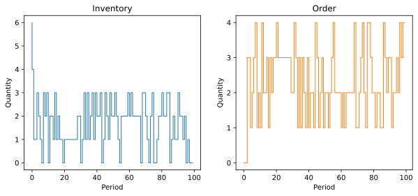

# Summary

Identifying optimal policies for replenishing inventory from multiple suppliers is a key problem in inventory management. Solving such optimization problems requires determining the quantities to order from each supplier based on the current inventory and outstanding orders, minimizing the expected ordering, holding, and out-of-stock costs. Despite over 60 years of extensive research on inventory management problems, even fundamental dual-sourcing problems—where orders from an expensive supplier arrive faster than orders from a low-cost supplier—remain analytically intractable [@barankin1961delivery; @fukuda1964optimal]. Additionally, there is a growing interest in optimization algorithms that can handle real-world inventory problems with non-stationary demand [@song2020capacity].

We provide a Python package, `idinn`, which implements inventory dynamics-informed neural networks designed to control both single-sourcing and dual-sourcing problems. In single-sourcing problems, a single supplier delivers an ordered quantity to the firm within a known lead time (the time it takes for orders to arrive) and at a known unit cost (the cost of ordering a single item). In dual-sourcing problems, which are more complex, the company has two potential suppliers of a product, each with different known lead times and unit costs. The company's decision problem is to determine the quantity to order from each of the two suppliers at the beginning of each period, given the history of past orders and the current inventory level. The objective is to minimize the expected order, inventory, and out-of-stock costs over a finite or infinite horizon. idinn implements neural network controllers and inventory dynamics as customizable objects using PyTorch as the backend, allowing users to identify near-optimal ordering policies for their needs with reasonable computational resources.

The methods used in `idinn` take advantage of advances in automatic differentiation [@paszke2017automatic; @PaszkeGMLBCKLGA19] and the growing use of neural networks in dynamical system identification [@wang1998runge; @ChenRBD18; @fronk2023interpretable] and control [@asikis2022neural; @bottcher2022ai; @bottcher2022near; @mowlavi2023optimal; @bottcher2023gradient; @bottcher2024control]. 

# Statement of need

Inventory management problems arise in many industries, including manufacturing, retail, hospitality, fast fashion, warehousing, and energy. A fundamental but analytically intractable inventory management problem is dual sourcing [@barankin1961delivery; @fukuda1964optimal; @xin2023dual]. `idinn` is a Python package for controlling dual-sourcing inventory dynamics with dynamics-informed neural networks. The classical dual-sourcing problem we consider is usually formulated as an infinite-horizon problem focusing on minimizing average cost while considering stationary stochastic demand. Using neural networks, we minimize costs over multiple demand trajectories. This approach allows us to address not only non-stationary demand, but also finite-horizon and infinite-horizon discounted problems. Unlike traditional reinforcement-learning approaches, our optimization approach takes into account how the system to be optimized behaves over time, leading to more efficient training and accurate solutions.

Training neural networks for inventory dynamics control presents a unique challenge. The adjustment of neural network weights during training relies on propagating real-valued gradients, while the neural network outputs - representing replenishment orders - must be integers. To address this challenge in optimizing a discrete problem with real-valued gradient descent learning algorithms, we apply a problem-tailored straight-through estimator [@yang2022injecting; @asikis2023multi; @dyer2023]. This approach enables us to obtain integer-valued neural network outputs while backpropagating real-valued gradients.

`idinn` has been developed for researchers, industrial practitioners and students working at the intersection of optimization, operations research, and machine learning. It has been made available to students in a machine learning course at the Frankfurt School of Finance & Management, as well as in a tutorial at California State University, Northridge, showcasing the effectiveness of artificial neural networks in solving real-world optimization problems. In a previous publication [@bottcher2023control], a proof-of-concept codebase was used to compute near-optimal solutions of dozens of dual-sourcing instances.

# Example usage

## Single-sourcing problems

The overarching goal in single-sourcing and related inventory management problems is for companies to identify the optimal order quantities to minimize inventory-related costs, given stochastic demand. During periods when inventory remains after demand is satisfied, each unit of excess inventory incurs a holding cost $h$. If demand exceeds available inventory in one period, the excess demand  incurs an out-of-stock cost $b$. To solve this problem using `idinn`, we first initialize the sourcing model and its associated neural network controller. Then, we train the neural network controller using costs generated by the sourcing model. Finally, we can use the trained neural network controller to compute near-optimal order quantities that depend on the state of the system.

### Initialization

We use the `SingleSourcingModel` class to initialize a single-sourcing model. The single-sourcing model considered in this example has a lead time of 0 (i.e., the order arrives immediately after it is placed) and an initial inventory of 10. The holding cost, $h$, and the out-of-stock cost, $b$, are 5 and 495, respectively. Demand is drawn from a discrete uniform distribution over the integers $\{0,1,\dots,4\}$. We use a batch size of 32 to train the neural network, i.e., the sourcing model generates 32 samples simultaneously. The sourcing model is initialized in code as follows.

```python
import torch
from idinn.sourcing_model import SingleSourcingModel
from idinn.single_controller import SingleSourcingNeuralController
from idinn.demand import UniformDemand

single_sourcing_model = SingleSourcingModel(
    lead_time=0,
    holding_cost=5,
    shortage_cost=495,
    batch_size=32,
    init_inventory=10,
    demand_generator=UniformDemand(low=0, high=4)
)
```

In single-sourcing problems, three events occur within each period. First, the current inventory, $I_t$, and the history of past orders that have not yet arrived (i.e., the vector $(q_{t-1}, q_{t-2}, \dots, q_{t-l})$) are used as inputs for the controller to calculate the order quantity, $q_t$. Second, the previous order quantity $q_{t-l}$ arrives. Third, the demand for the current period, $D_t$, is realized, resulting in a new inventory level, $I_t+q_{t-l}-D_t$. Using the updated inventory, the cost for the individual period, $c_t$, is calculated according to

$$
c_t = h \max(0, I_t) + b \max(0, - I_t)\,,
$$

where $I_t$ is the inventory level at the end of period $t$. The higher the holding cost, the more costly it is to keep inventory positive and high. The higher the out-of-stock cost, the more costly it is to run out of stock when the inventory level is negative. The goal is to identify an ordering policy that minimizes total costs over a given time horizon. The interested reader is referred to @bottcher2023control for further details.

To control single-sourcing dynamics, we initialize a neural network controller using the `SingleSourcingNeuralController` class. For illustration purposes, we use a simple neural network with 1 hidden layer and 2 neurons. The activation function is `torch.nn.CELU(alpha=1)`.

```python
single_controller = SingleSourcingNeuralController(
    hidden_layers=[2],
    activation=torch.nn.CELU(alpha=1)
)
```

### Training

We train the neural network controller using the `fit()` method, with training data generated from the considered sourcing model. To monitor the training process, we specify the `tensorboard_writer` parameter to log both the training loss and the validation loss. For reproducibility, we also specify the seed of the underlying random number generator using the `seed` parameter.

```python
from torch.utils.tensorboard import SummaryWriter

single_controller.fit(
    sourcing_model=single_sourcing_model,
    sourcing_periods=50,
    validation_sourcing_periods=1000,
    epochs=2000,
    tensorboard_writer=SummaryWriter(comment="_single_1"),
    seed=1
)
```

To evaluate the neural network controller, we compute the average cost over a specified number of periods for the previously defined sourcing model. In the following example, the average cost is computed over 1,000 periods.


```python
single_controller.get_average_cost(single_sourcing_model, sourcing_periods=1000)
```

For the selected single-sourcing parameters, the optimal average cost is 10.

### Order calculation

For a given inventory level and trained controller, we use the `predict` function to compute the corresponding orders. In the following example, we set the current inventory level to 10.

```python
single_controller.predict(current_inventory=10)
```

This function returns the order quantity under the `single_controller` policy, given a current inventory level of 10.

### Base-stock controller

In addition to the neural network control method, single-sourcing dynamics can also be managed using a traditional base-stock controller [@arrow1951optimal; @scarf1958inventory]. This approach provides a useful baseline for comparison and is often employed in inventory management due to its simplicity and interpretability.

The example below demonstrates how to initialize, train, and evaluate a base-stock controller using the same single-sourcing model.

```python
from idinn.single_controller import BaseStockController

single_controller_base = BaseStockController()
single_controller_base.fit(single_sourcing_model)
single_controller_base.get_average_cost(single_sourcing_model, sourcing_periods=1000)
```

As with the neural network controller, order decisions can be made using the `predict` function.

```python
single_controller_base.predict(current_inventory=10)
```

This function returns the optimal order quantity under the base-stock policy, given a current inventory level of 10.

## Dual-sourcing problems

Solving dual-sourcing problems with `idinn` follows a similar workflow to that of single-sourcing problems, as described in the previous section. The key difference is that the cost calculation accounts for the ordering costs from two distinct suppliers.

### Initialization

To solve dual-sourcing problems, we use the `DualSourcingModel` and `DualSourcingNeuralController` classes, which define the sourcing model and its associated controller.  In the example below, we examine a dual-sourcing model characterized by the following parameters: the regular order lead time is 2; the expedited order lead time is 0; the regular order cost, $c_r$, is 0; the expedited order cost, $c_e$, is 20; and the initial inventory is 6. Additionally, the holding cost, $h$, and the out-of-stock cost, $b$, are 5 and 495, respectively. Demand is drawn from a discrete uniform distribution over the integers $\{0,1,\dots,4\}$ and the batch size is 256.

```python    
import torch
from idinn.sourcing_model import DualSourcingModel
from idinn.dual_controller import DualSourcingNeuralController
from idinn.demand import UniformDemand

dual_sourcing_model = DualSourcingModel(
    regular_lead_time=2,
    expedited_lead_time=0,
    regular_order_cost=0,
    expedited_order_cost=20,
    holding_cost=5,
    shortage_cost=495,
    batch_size=256,
    init_inventory=6,
    demand_generator=UniformDemand(low=0, high=4)
)
```

In dual-sourcing dynamics, the cost in period $t$, $c_t$, is

$$
c_t = c_r q^r_t + c_e q^e_t + h \max(0, I_t) + b \max(0, - I_t)\,,
$$

where $I_t$ is the inventory level at the end of period $t$, $q^r_t$ is the regular order placed in period $t$, and $q^e_t$ is the expedited order placed in period $t$. The higher the holding cost, the more expensive it is to keep inventory positive and high. The higher the out-of-stock cost, the more expensive it is to run out of stock when inventory is negative. The higher the regular and expedited order costs, the more expensive it is to place those orders.

To control dual-sourcing dynamics, we initialize a neural network controller using the `DualSourcingNeuralController` class. We use a simple neural network with six hidden layers. The number of neurons in each layer is 128, 64, 32, 16, 8, and 4, respectively. The activation function is `torch.nn.CELU(alpha=1)`.

```python
dual_controller = DualSourcingNeuralController(
    hidden_layers=[128, 64, 32, 16, 8, 4],
    activation=torch.nn.CELU(alpha=1)
)
```

The inputs to the controller are the inventory level, $I_t$, and the history of past orders. Since there are now two suppliers in the system, we need to include the order history of both suppliers. Therefore, the inputs associated with the past orders are $(q^r_{t-1}, \dots, q^r_{t-l_r}, q^e_{t-1}, \dots, q^e_{t-l_e})$. The cost for each period is calculated similarly to the single-sourcing model: past orders arrive, new orders are placed, and demand is realized. The objective remains to identify an ordering policy that minimizes total costs over a given time horizon. The interested reader is referred to @bottcher2023control for more details. 

### Training

As in the previous section, we train the neural network controller using the `fit()` method.

```python
from torch.utils.tensorboard import SummaryWriter

dual_controller.fit(
    sourcing_model=dual_sourcing_model,
    sourcing_periods=100,
    validation_sourcing_periods=1000,
    epochs=2000,
    tensorboard_writer=SummaryWriter(comment="dual"),
    seed=123
)
```

To evaluate the neural network controller, we compute the average cost over a specified number of periods using the previously defined sourcing model. In the example below, the average cost is computed over 1,000 periods.

```python    
dual_controller.get_average_cost(dual_sourcing_model, sourcing_periods=1000)
```

For the selected dual-sourcing parameters, the optimal average cost is 23.07.

### Order calculation

For a given dual-sourcing controller, orders can be computed as follows.

```python
dual_controller.predict(current_inventory=10, past_regular_orders=[1, 1], past_expedited_orders=None)
```

If the regular and expedited lead-time values are greater than 0, one has to specify the corresponding `past_regular_orders` and `past_expedited_orders`.

### Other dual-sourcing controllers

In addition to the neural network control method, dual-sourcing dynamics can also be managed using capped dual index [@sun2019robust] and dynamic programming controllers. These methods offer valuable baselines for comparison. The example below illustrates how to initialize and train these controllers using the same dual-sourcing model.

```python
from idinn.dual_controller import CappedDualIndexController, DynamicProgrammingController

dual_controller_cdi = CappedDualIndexController()
dual_controller_cdi.fit(
   dual_sourcing_model,
   sourcing_periods=100
)

dual_controller_dp = DynamicProgrammingController()
dual_controller_dp.fit(
   dual_sourcing_model,
   max_iterations=10000,
   tolerance=1e-6
)
```

As with the dual-sourcing neural network controller, average costs and order quantities can be computed using the `.get_average_cost()` and `.predict()` methods, respectively.

## Other utility functions

The `idinn` package includes several utility functions for both the `SingleSourcingModel` and `DualSourcingModel` classes.



To further evaluate a controller's performance in a given sourcing environment, users can visualize the inventory and order histories (see Figure 1).

```python
single_controller.plot(sourcing_model=single_sourcing_model, sourcing_periods=100)
```

In addition to the discrete uniform demand distributions used in the previous sections, custom demand distributions can also be defined using the `CustomDemand` class together with a `demand_generator`. The `CustomDemand` class accepts a dictionary specifying possible demand values and their associated probabilities. We show an example of a dual-sourcing model with custom demand distribution below.

```python
from idinn.demand import CustomDemand

dual_sourcing_model = DualSourcingModel(
    regular_lead_time=2,
    expedited_lead_time=0,
    regular_order_cost=0,
    expedited_order_cost=20,
    holding_cost=5,
    shortage_cost=495,
    init_inventory=0,
    demand_generator=CustomDemand({5: 0.02, 6: 0.9, 7: 0.02, 8: 0.02, 9: 0.02, 10: 0.02})
)
```

In this dual-sourcing model, there is a 90% probability that the demand will be 6, and a 2% probability that the demand will be either 5, 7, 8, 9, or 10, respectively. The `CustomDemand` generator allows users to input demands customized to their specific requirements.

The `idinn` package also provides functions for saving and loading model checkpoints. To save and load a given model, one can use the `save()` and `load()` methods, respectively.

```python
# Save the model
dual_controller.save("optimal_dual_sourcing_controller.pt")
# Load the model
dual_controller_loaded = DualSourcingNeuralController(
    hidden_layers=[128, 64, 32, 16, 8, 4],
    activation=torch.nn.CELU(alpha=1)
)
dual_controller_loaded.init_layers(
    regular_lead_time=2,
    expedited_lead_time=0
)
dual_controller_loaded.load("optimal_dual_sourcing_controller.pt")
```

For controllers that are not based on neural networks, Python’s `pickle` module can be used for saving and loading. Further details are provided in the official `idinn` documentation.

# Acknowledgements

LB acknowledges financial support from hessian.AI and the Army Research Office (grant W911NF-23-1-0129). TA acknowledges financial support from the Schweizerischer Nationalfonds zur Förderung der Wissenschaf­tlichen Forschung through NCCR Automation (grant P2EZP2 191888).

# References