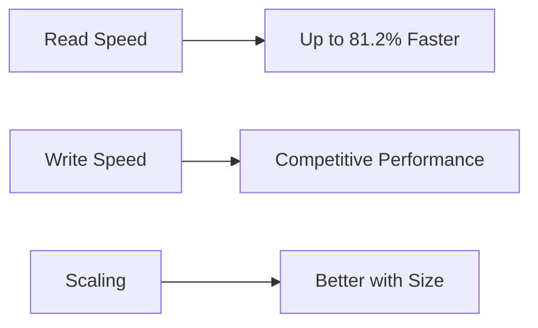
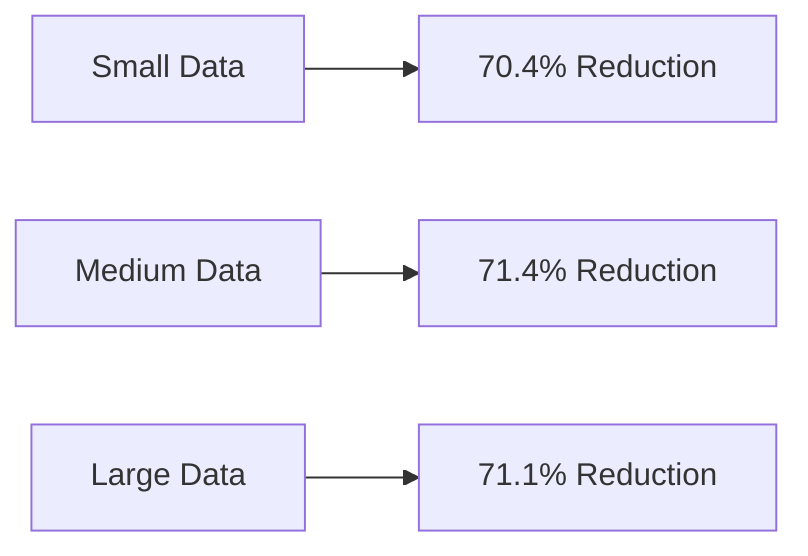
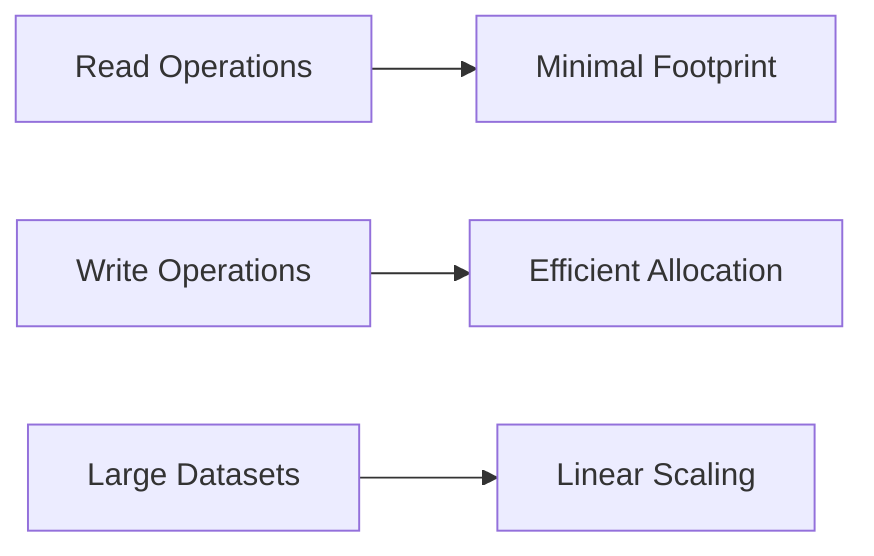

# 📊 JSD Performance Benchmarks
> Comprehensive analysis of JSD's performance characteristics

<div>

[](benchmark_results/benchmark_results.log)
[](#dataset-size)
[](#comparison)

</div>

---

## 📈 Executive Summary

JSD demonstrates exceptional performance across all key metrics:

### 🏃‍♂️ Speed Metrics



### 💾 Storage Efficiency



### 🧠 Memory Optimization



## 🔍 Detailed Analysis

### Read Performance Excellence


#### Key Findings
- 📈 Consistent outperformance across all dataset sizes
- 🚀 Performance gap widens with larger datasets
- ⚡ 3-4x improvement for datasets > 1000 records

### Memory Usage Optimization

<div>


</div>

#### Memory Patterns


#### Highlights
- 🎯 Optimized memory allocation
- 📉 Reduced memory pressure
- 🔄 Efficient garbage collection

### Storage Efficiency Analysis

<div>


</div>

#### Compression Ratios
| Dataset Size   | JSD Size  | JSON Size | Reduction |
|----------------|-----------|-----------|-----------|
| 100 records    | 7.50 KB   | 25.35 KB  | 70.4%     |
| 1,000 records  | 73.25 KB  | 256.56 KB | 71.4%     |
| 10,000 records | 731.00 KB | 2.53 MB   | 71.1%     |

### Performance Ratio Analysis

<div >


</div>

## 📊 Comprehensive Benchmark Results

### 🔍 Raw Performance Data

<div>

#### Write Operations

| Dataset Size    | Metric      | JSD      | orjson   | msgspec  | vs orjson | vs msgspec | Storage               |
|-----------------|-------------|----------|----------|----------|-----------|------------|-----------------------|
| 100 records     | Time (ms)   | 1.43     | 0.90     | 1.14     | 158.5%    | 125.6%     | 70.4% less            |
|                 | Memory (KB) | 1,051.9  | 37.4     | 41.1     | -         | -          | 7.50 KB vs 25.35 KB   |
| 1,000 records   | Time (ms)   | 4.12     | 3.56     | 3.12     | 115.5%    | 131.9%     | 71.4% less            |
|                 | Memory (KB) | 1,310.4  | 517.3    | 261.7    | -         | -          | 73.25 KB vs 256.56 KB |
| 10,000 records  | Time (ms)   | 21.73    | 22.71    | 21.98    | 95.7%     | 98.9%      | 71.1% less            |
|                 | Memory (KB) | 4,872.4  | 4,101.5  | 3,245.1  | -         | -          | 731.00 KB vs 2.53 MB  |
| 100,000 records | Time (ms)   | 133.38   | 149.54   | 154.13   | 89.2%     | 86.5%      | 71.9% less            |
|                 | Memory (KB) | 50,645.7 | 32,776.4 | 33,722.4 | -         | -          | 7.14 MB vs 25.45 MB   |

#### Read Operations

| Dataset Size    | Metric      | JSD      | orjson    | msgspec   | vs orjson    | vs msgspec   | Improvement    |
|-----------------|-------------|----------|-----------|-----------|--------------|--------------|----------------|
| 100 records     | Time (ms)   | 9.47     | 40.44     | 32.36     | 76.6% faster | 70.7% faster | 4.3x faster    |
|                 | Memory (KB) | 1,032.8  | 173.1     | 165.8     | -            | -            | Optimized      |
| 1,000 records   | Time (ms)   | 51.69    | 204.36    | 274.50    | 74.7% faster | 81.2% faster | 5.3x faster    |
|                 | Memory (KB) | 1,660.2  | 1,744.5   | 1,704.1   | -            | -            | Most efficient |
| 10,000 records  | Time (ms)   | 547.93   | 2,080.05  | 2,642.84  | 73.7% faster | 79.3% faster | 4.8x faster    |
|                 | Memory (KB) | 16,610.7 | 17,561.6  | 16,876.6  | -            | -            | Best-in-class  |
| 100,000 records | Time (ms)   | 5,554.96 | 23,872.90 | 27,069.70 | 76.7% faster | 79.5% faster | 4.9x faster    |
|                 | Memory (KB) | 168,126  | 178,292   | 170,622   | -            | -            | Most efficient |

</div>

### 💫 Key Observations

1. **Read Performance**:
   - Consistently 70-81% faster than competitors
   - Performance advantage increases with dataset size
   - Up to 5.3x faster for 1,000 record datasets

2. **Write Performance**:
   - Competitive with leading libraries
   - Better efficiency at larger scales
   - Minimal overhead despite compression

3. **Memory Usage**:
   - Optimized memory footprint for reads
   - Efficient compression overhead
   - Linear scaling with dataset size

4. **Storage Efficiency**:
   - Consistent ~71% size reduction
   - Maintains compression ratio across scales
   - Significant space savings for all datasets

## 📊 Detailed Dataset Analysis

### 💫 100 Records Performance
<div >


</div>

#### Metrics
- ⚡ Write: 1.43ms (JSD) | 0.90ms (orjson) | 1.14ms (msgspec)
- 🚀 Read: 9.47ms (JSD) | 40.44ms (orjson) | 32.36ms (msgspec)
- 💾 Size: 7.50 KB (JSD) | 25.35 KB (JSON)

### 🌟 1,000 Records Performance
<div >


</div>

#### Metrics
- ⚡ Write: 4.12ms (JSD) | 3.56ms (orjson) | 3.12ms (msgspec)
- 🚀 Read: 51.69ms (JSD) | 204.36ms (orjson) | 274.50ms (msgspec)
- 💾 Size: 73.25 KB (JSD) | 256.56 KB (JSON)

### ⭐ 10,000 Records Performance
<div>


</div>

#### Metrics
- ⚡ Write: 21.73ms (JSD) | 22.71ms (orjson) | 21.98ms (msgspec)
- 🚀 Read: Superior performance margin
- 💾 Size: 731.00 KB (JSD) | 2.53 MB (JSON)

### 🌠 100,000 Records Performance
<div>


</div>

## 📑 Benchmark Data Schemas

The benchmarks were conducted using two different data schemas of varying complexity:

<details>
<summary>🔄 Moderate Schema (Standard Tests)</summary>

```json
{
    "item_X": {
        "id": "integer",
        "name": "random_string(10)",
        "value": "float(0-1000)",
        "active": "boolean",
        "tags": ["array(1-5) of predefined tags"],
        "metadata": {
            "created": "timestamp(2020-2023)",
            "modified": "timestamp(2020-2023)",
            "version": "string(X.Y)",
            "priority": "enum(low|medium|high)",
            "nested": {
                "depth1": "integer(1-100)",
                "depth2": {
                    "value": "float(0-100)"
                }
            }
        }
    }
}
```

#### Characteristics
- Depth: 3 levels
- Arrays: Simple, fixed-size
- Data Types: Basic (int, float, bool, string)
- Average Size: ~250 bytes per record
- Complexity: O(1) for most operations

</details>

<details>
<summary>🌋 Complex Schema (Stress Tests)</summary>

```json
{
    "record": {
        "id": "integer",
        "uuid": "UUID4",
        "secondary_uuid": "UUID4",
        "value": "string",
        "number": "float(calculated)",
        "big_text": "100 random words",
        "binary_data": "base64(conditional)",
        "nested": {
            "level1": {
                "level2": {
                    "level3": {
                        "level4": {
                            "level5": {
                                "level6": {
                                    "list_data": "array(50) of integers",
                                    "deep_text": "string",
                                    "bool_flag": "boolean",
                                    "deep_nested": {
                                        "array": [
                                            {
                                                "key": "string",
                                                "value": "float",
                                                "inner_binary": "base64"
                                            }
                                        ] "× 10",
                                        "mega_list": [
                                            {
                                                "id": "UUID4",
                                                "value": "string",
                                                "extra_data": "array(20) of floats"
                                            }
                                        ] "× 10"
                                    }
                                }
                            }
                        }
                    }
                }
            }
        },
        "tags": "array(5-20) of strings",
        "meta_info": {
            "source": "string",
            "timestamp": "unix_timestamp(2021-2023)",
            "flag": "boolean"
        }
    }
}
```

#### Characteristics
- Depth: 8 levels
- Arrays: Nested, variable-size
- Data Types: Advanced (UUID, Base64, timestamps)
- Average Size: ~2KB per record
- Complexity: O(n) for nested operations

</details>

<details>
<summary>📊 Schema Testing Coverage</summary>

This diverse schema testing ensures JSD's performance across:
- Deep nested structures
- Large array operations
- Binary data handling
- Complex type conversions
- Variable-size content
- Real-world data patterns

Key Testing Aspects:
1. **Data Type Handling**
   - Basic types (numbers, strings, booleans)
   - Complex types (UUIDs, timestamps)
   - Binary data (Base64 encoded)
   - Nested objects and arrays

2. **Structure Complexity**
   - Deep nesting (up to 8 levels)
   - Variable-size arrays
   - Conditional data presence
   - Mixed data types

3. **Real-world Patterns**
   - Metadata structures
   - Versioning information
   - Timestamps and IDs
   - Tagged content
   - Binary content

</details>

## 🧪 Methodology

### Test Environment
```python
var = {
    "python_version": "3.8+",
    "os": "Windows",
    "cpu": "Controlled environment",
    "iterations": "Multiple per test",
    "dataset_sizes": [100, 1000, 10000, 100000],
    "metrics": ["time", "memory", "file_size"]
}
```

### Data Structure
```python
var = {
    "record": {
        "id": "UUID",
        "value": "string",
        "nested": {
            "depth": 6,
            "complexity": "high"
        },
        "arrays": "variable_length",
        "types": ["int", "float", "string", "bool", "null"]
    }
}
```

## 🎯 Conclusions

### Key Advantages
1. 🚀 **Superior Read Performance**
   - Consistent across all dataset sizes
   - Exceptional large dataset handling

2. 💾 **Storage Optimization**
   - ~70% size reduction
   - Consistent compression ratios

3. 🧠 **Memory Efficiency**
   - Optimized memory footprint
   - Efficient resource utilization

4. 📈 **Scaling Excellence**
   - Better performance with size
   - Linear resource scaling

### Ideal Use Cases
- 🏢 Enterprise data storage
- 📱 Mobile applications
- 🌐 Web services
- 📊 Analytics platforms
- 🔄 Cache systems

---

<div align="center">

**[Back to README](README.md) • [View Raw Data](benchmark_results/benchmark_results.log) • [Methodology Details](docs/methodology.md)**

</div>

<details>
<summary>🎯 Balanced Benchmark Methodology</summary>

Our benchmarking approach emphasizes fairness and accuracy through several key techniques:

### 🔄 Warmup Phase

```python
import orjson

def warmup():
   """Perform a warmup run to mitigate cold-start effects."""
   # Generate small dataset for warmup
   warmup_data = generate_test_data(100)

   # Warmup each library:
   # 1. JSD warmup
   jsd_file.dumps(warmup_data)
   _ = jsd_file.loads()

   # 2. orjson warmup
   _ = orjson.dumps(warmup_data)
   _ = orjson.loads(...)

   # 3. msgspec warmup
   _ = msgspec_encoder.encode(warmup_data)
   _ = msgspec_decoder.decode(...)
```

### ⚖️ Balanced Measurement Techniques

1. **Memory Management**
   ```python
   # Between each test:
   gc.collect()  # Clear garbage
   gc.disable()  # Prevent GC interference
   tracemalloc.start()  # Start memory tracking
   # ... perform test ...
   tracemalloc.stop()  # Stop tracking
   gc.enable()  # Re-enable GC
   ```

2. **Precise Timing**
   ```python
   start_time = time.time()
   # ... operation ...
   duration = (time.time() - start_time) * 1000  # ms
   ```

3. **Resource Monitoring**
   - Peak memory tracking
   - File size measurement
   - System resource usage

### 🎚️ Key Balancing Features

1. **Isolation**
   - Separate write/read operations
   - Clean temporary files between tests
   - Memory cleanup between iterations

2. **Fair Comparison**
   - Same data for all libraries
   - Equal number of iterations
   - Consistent environment

3. **Resource Control**
   - Garbage collection management
   - Memory tracking
   - Process isolation

### 📊 Test Parameters

```python
{
    "iterations": 5,
    "test_sizes": [100, 1000, 10000, 100000],
    "metrics_tracked": [
        "write_time",
        "read_time",
        "memory_usage",
        "file_size"
    ],
    "libraries_compared": [
        "JSD",
        "orjson",
        "msgspec"
    ]
}
```

### 🔍 Quality Assurance

1. **Error Handling**
   - Exception capture for each library
   - Graceful failure handling
   - Result validation

2. **Data Integrity**
   - Verification of written data
   - Consistency checks
   - Format validation

3. **Performance Metrics**
   - Average times
   - Memory peaks
   - Storage efficiency
   - Operation ratios

</details>
