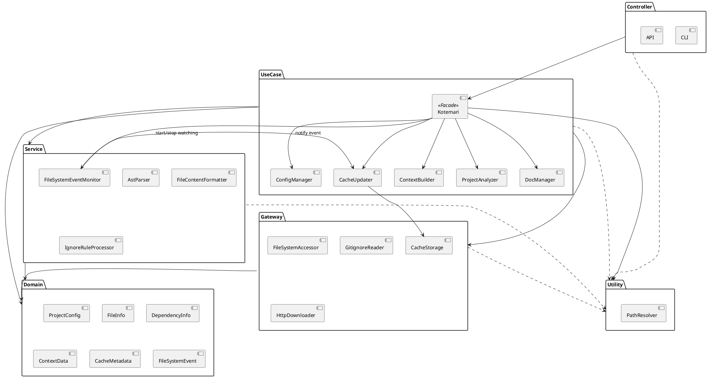
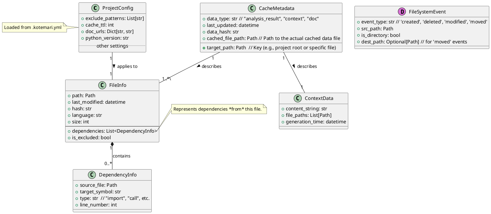

# アーキテクチャ設計書

## 1. システム構成・アーキテクチャの概要

本システム「こてまり」は、保守性と拡張性を高めるため、クリーンアーキテクチャに類似したレイヤー構造を採用します。各レイヤーは特定の責務を持ち、依存関係は一方向に保たれます（外側から内側へ）。

### レイヤー構成

*   **Controller:** ユーザー（CLI、API経由）からの入力を受け付け、**`Kotemari`ファサード**を呼び出します。
*   **UseCase:** アプリケーションのコアロジック、機能（ユースケース）フローを実装します。ServiceやGatewayを利用して処理を実行します。
*   **Service:** 特定の技術や複雑なアルゴリズム（構文解析、除外ルール処理、ファイル監視など）を実装します。UseCaseから利用されます。
*   **Gateway:** 外部システム（ファイルシステム、キャッシュストレージ、ネットワーク）とのインターフェースを提供します。
*   **Domain:** アプリケーションの中心となるデータ構造（エンティティ）を定義します。ファイルシステムイベント(`FileSystemEvent`)もここに含まれます。
*   **Utility:** パス解決など、横断的に利用される機能を提供します。

## 2. 主要インターフェース

要件定義書にある各機能（ユースケース）を実現するための主要なクラス（インターフェース）を以下に示します。

| クラス名               | 所属レイヤー | 責務                                                                                     | 関連ユースケース |
| :--------------------- | :----------- | :--------------------------------------------------------------------------------------- | :--------------- |
| `Kotemari`             | UseCase      | **(修正)** ライブラリ利用者のための主要な受付(ファサード)。各種機能の実行を内部UseCaseに委譲する。ファイル監視の開始/停止も管理。 | UC-01 - UC-10    |
| `CliController`        | Controller   | **(修正)** CLIからのコマンドを受け付け、`Kotemari`ファサードを通じて機能実行を指示する。       | UC-01 - UC-10    |
| `ApiController`        | Controller   | **(修正)** APIリクエストを受け付け、`Kotemari`ファサードを通じて機能実行を指示する。          | UC-10            |
| `ProjectAnalyzer`      | UseCase      | プロジェクトファイルを走査し、ファイル情報(`FileInfo`)のリストを生成する。                     | UC-01, UC-09     |
| `ContextBuilder`       | UseCase      | `FileInfo`リストと対象ファイルから、LLMプロンプト用のコンテキスト(`ContextData`)を生成する。 | UC-02            |
| `CacheUpdater`         | UseCase      | **(修正)** `analyze_project`実行時、または`FileSystemEventMonitor`からの通知に基づき、キャッシュ(`CacheMetadata`, `ContextData`)を更新/無効化する。 | UC-03            |
| `ConfigManager`        | UseCase      | 設定ファイル(`.kotemari.yml`)を読み込み、`ProjectConfig`を管理する。   | UC-07            |
| `DocManager`           | UseCase      | 外部ライブラリドキュメントの取得・キャッシュ管理を行う。                      | UC-05            |
| `AstParser`            | Service      | PythonコードのASTを解析し、依存関係(`DependencyInfo`)を抽出する。       | UC-04            |
| `FileContentFormatter` | Service      | ファイル内容をシステムプロンプトに適した形式に整形する。                     | UC-02            |
| `IgnoreRuleProcessor`  | Service      | `.gitignore`等のルールに基づき、ファイルをフィルタリングする。              | UC-01            |
| `FileSystemAccessor`   | Gateway      | ファイルシステムへの読み書きアクセスを提供する。                           | UC-01, UC-03     |
| `CacheStorage`         | Gateway      | 解析結果やコンテキストデータ、メタデータを永続化/読み込みする。              | UC-03, UC-05     |
| `GitignoreReader`      | Gateway      | `.gitignore`ファイルを読み込み、除外パターンを提供する。                   | UC-01            |
| `HttpDownloader`       | Gateway      | HTTP経由で外部リソース（ドキュメント等）をダウンロードする。                 | UC-05            |
| `FileSystemEventMonitor` | Service      | **(新規)** `watchdog` を利用し、ファイルシステムの変更イベントを監視・通知する。          | UC-03 (リアルタイム) |
| `PathResolver`         | Utility      | ファイルパスの正規化や絶対パスへの変換を行う。                             | 横断的           |

### 2.1 `Kotemari` ファサードクラスのメソッド

`Kotemari` クラスは、ライブラリの機能を外部から利用するための主要なメソッドを提供します。

| メソッド名           | 引数                                           | 戻り値                                     | 説明                                                                                                                               | 関連ユースケース |
| :------------------- | :--------------------------------------------- | :----------------------------------------- | :--------------------------------------------------------------------------------------------------------------------------------- | :--------------- |
| `__init__`           | `project_root: Path`, `config_path: Path = None` | `None`                                     | `Kotemari` インスタンスを初期化します。プロジェクトルートを設定し、設定ファイルがあれば読み込みます (`ConfigManager` を利用)。         | UC-07            |
| `analyze_project`    | `use_cache: bool = True`                       | `List[FileInfo]`                           | プロジェクト全体を解析し、ファイルのリスト (`FileInfo`) を返します (`ProjectAnalyzer` を利用)。キャッシュの利用有無を指定できます。         | UC-01            |
| `get_context`        | `target_file: Path`, `use_cache: bool = True`  | `ContextData`                              | 指定されたファイルに関連するコンテキスト (`ContextData`) を生成して返します (`ContextBuilder`, `CacheUpdater` を利用)。キャッシュ利用も指定可能。 | UC-02, UC-03     |
| `list_files`         | `use_cache: bool = True`                       | `List[Path]`                               | 解析対象となるファイルのパスリストを返します。内部で `analyze_project` を呼び出す場合があります。                                        | UC-09            |
| `get_tree`           | `use_cache: bool = True`                       | `str`                                      | 解析対象となるファイルのディレクトリ構造をツリー形式の文字列で返します。内部で `analyze_project` を呼び出す場合があります。               | UC-09            |
| `get_dependencies`   | `target_file: Path`, `use_cache: bool = True`  | `List[DependencyInfo]`                     | 指定されたファイルの依存関係情報 (`DependencyInfo`) のリストを返します (`AstParser` の結果を利用)。                                   | UC-04            |
| `start_watching`     | `callback: Callable[[FileSystemEvent], None] = None` | `None`                                     | **(新規)** ファイルシステムの変更監視を開始します。変更イベント発生時のコールバック関数を指定可能。(`FileSystemEventMonitor` を利用) | UC-03 (リアルタイム) |
| `stop_watching`      | `None`                                         | `None`                                     | **(新規)** ファイルシステムの変更監視を停止します。(`FileSystemEventMonitor` を利用)                                                | UC-03 (リアルタイム) |
| `fetch_external_docs`| `force_update: bool = False`                   | `None`                                     | 設定ファイルで指定された外部ライブラリのドキュメントを取得・キャッシュします (`DocManager` を利用)。                                   | UC-05            |
| `clear_cache`        | `target: str = "all"`                          | `None`                                     | 指定された対象（"all", "analysis", "context", "docs" など）のキャッシュを削除します (`CacheStorage` を利用)。                          | UC-03            |

## 3. 主要データ（データの種類、構造）

システム内で扱われる主要なデータクラスとその関係を示します。

| データクラス名  | 説明                                                                 | 主要な属性                                          |
| :-------------- | :------------------------------------------------------------------- | :-------------------------------------------------- |
| `ProjectConfig` | ユーザー設定(`.kotemari.yml`)の内容を保持する。                        | `exclude_patterns`, `cache_ttl`, `doc_urls` など    |
| `FileInfo`      | 個々のファイルに関する情報。                                           | `path`, `last_modified`, `hash`, `language`, `dependencies` |
| `DependencyInfo`| ファイル間の依存関係情報。                                           | `source_file`, `target_symbol`, `type` (`import`, `call`) |
| `ContextData`   | システムプロンプト生成用の結合されたコンテキスト情報。                   | `content_string`, `metadata` (構成ファイルリスト等)     |
| `CacheMetadata` | キャッシュされたデータ（`ContextData`等）のメタ情報。                 | `file_path`, `last_updated`, `hash`                 |
| `FileSystemEvent`| ファイルシステムイベントの種類と対象パスを保持する。                 | `event_type` ('created', 'deleted', 'modified', 'moved'), `src_path`, `dest_path` |

### データクラス関連図 (ER図風 PlantUML)

