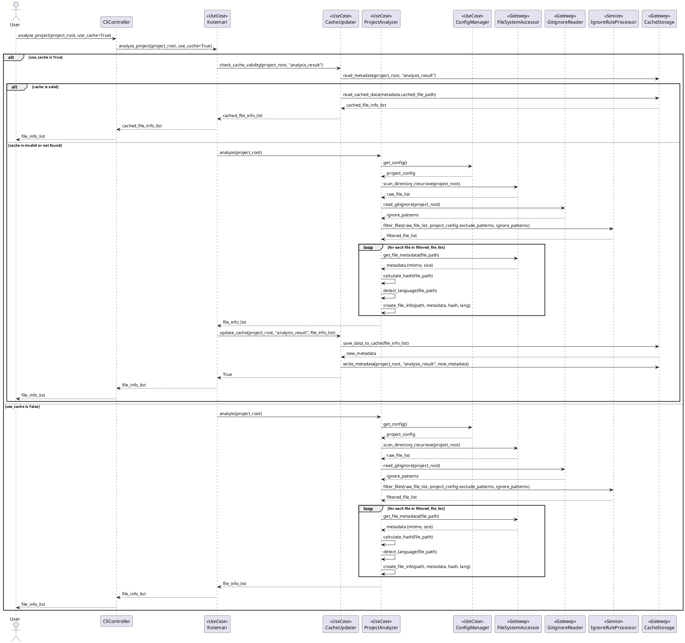
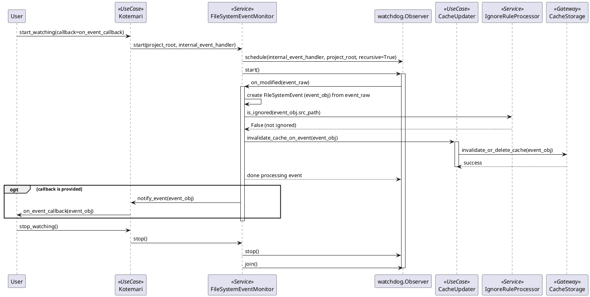

# 機能仕様書

本仕様書は、要件定義書で定義された各機能（ユースケース）について、その詳細な振る舞いを定義します。アーキテクチャ設計書で定義された主要なクラス（特に`Kotemari`ファサード）との連携を中心に記述します。

## UC-01: プロジェクト解析

### ユースケース手順

1.  利用者（CLIまたはAPI経由）は、プロジェクトルートを指定してプロジェクト解析を要求します。キャッシュ利用の有無も指定可能です。
2.  `Kotemari` ファサードは、指定されたプロジェクトルートとキャッシュ利用設定を受け取ります。
3.  (`use_cache=True` の場合) `Kotemari` は `CacheUpdater` を呼び出し、プロジェクト解析結果のキャッシュが存在し、かつ有効かを確認します。
4.  (キャッシュが有効な場合) `CacheUpdater` はキャッシュされた `List[FileInfo]` を返します。`Kotemari` はそれをそのまま利用者に返します。
5.  (キャッシュが無効または `use_cache=False` の場合) `Kotemari` は `ProjectAnalyzer` を呼び出してプロジェクト解析を実行します。
6.  `ProjectAnalyzer` は以下の処理を行います。
    a. `ConfigManager` から設定 (`ProjectConfig`) を取得します（除外ルールなど）。
    b. `FileSystemAccessor` を利用して、指定されたプロジェクトルート以下のファイル・ディレクトリを再帰的に走査します。
    c. `GitignoreReader` を利用して `.gitignore` ファイルを読み込み、除外パターンを取得します。
    d. `IgnoreRuleProcessor` を利用して、設定ファイルと `.gitignore` のルールに基づき、走査対象から不要なファイル・ディレクトリを除外します。
    e. 各ファイルについて、最終更新日時、ハッシュ値、言語などを特定し、`FileInfo` オブジェクトを作成します。(依存関係解析はここでは行わない or 別途 UC-04 で実施)
    f. 収集した `FileInfo` オブジェクトのリストを `Kotemari` に返します。
7.  (`use_cache=True` の場合) `Kotemari` は `CacheUpdater` を呼び出し、取得した `List[FileInfo]` をキャッシュに保存します。
8.  `Kotemari` は `List[FileInfo]` を利用者に返します。

### ユースケースフロー図 (シーケンス図)



---

## UC-02: システムプロンプト生成

### ユースケース手順

1.  利用者（CLIまたはAPI経由）は、コンテキスト生成の対象となるファイルパスを指定して、システムプロンプト生成を要求します。キャッシュ利用の有無も指定可能です。
2.  `Kotemari` ファサードは、対象ファイルパスとキャッシュ利用設定を受け取ります。
3.  (`use_cache=True` の場合) `Kotemari` は `CacheUpdater` を呼び出し、対象ファイルに対応するコンテキスト(`ContextData`)のキャッシュが存在し、かつ有効か（関連ファイルの変更がないか）を確認します。
4.  (キャッシュが有効な場合) `CacheUpdater` はキャッシュされた `ContextData` を返します。`Kotemari` はそれをそのまま利用者に返します。
5.  (キャッシュが無効または `use_cache=False` の場合) `Kotemari` は `ContextBuilder` を呼び出してコンテキスト生成を実行します。
6.  `ContextBuilder` は以下の処理を行います。
    a. `Kotemari.analyze_project()` を呼び出して、プロジェクト全体のファイル情報リスト (`List[FileInfo]`) を取得します (キャッシュ利用を考慮)。依存関係情報が必要な場合は、`Kotemari.get_dependencies()` も利用します (UC-04)。
    b. 対象ファイルとファイル情報リスト、(必要なら依存関係情報) に基づき、コンテキストに含めるべき関連ファイルを選択します。（選択ロジックは `ContextBuilder` の責務）
    c. `FileSystemAccessor` を利用して、選択された関連ファイルの内容を読み込みます。
    d. (必要なら) `FileContentFormatter` を利用して、ファイル内容を整形します（例: 行番号付与、不要部分削除）。
    e. 整形された内容を結合し、`ContextData` オブジェクト（コンテキスト文字列と関連ファイルリストを含む）を作成します。
    f. 作成した `ContextData` を `Kotemari` に返します。
7.  (`use_cache=True` の場合) `Kotemari` は `CacheUpdater` を呼び出し、取得した `ContextData` を対象ファイルパスに関連付けてキャッシュに保存します。
8.  `Kotemari` は `ContextData` を利用者に返します。

### ユースケースフロー図 (シーケンス図)

```plantuml
@startuml
actor User
participant CliController as CLI
participant Kotemari as Facade <<UseCase>>
participant CacheUpdater as CU <<UseCase>>
participant ContextBuilder as CB <<UseCase>>
participant ProjectAnalyzer as PA <<UseCase>>
participant AstParser as AP <<Service>> ' Optional for dependency info
participant FileSystemAccessor as FSA <<Gateway>>
participant FileContentFormatter as FCF <<Service>> ' Optional
participant CacheStorage as CS <<Gateway>>

User -> CLI : get_context(target_file, use_cache=True)
CLI -> Facade : get_context(target_file, use_cache=True)

alt use_cache is True
    Facade -> CU : check_cache_validity(target_file, "context")
    CU -> CS : read_metadata(target_file, "context")
    alt cache is valid
        CU -> CS : read_cached_data(metadata.cached_file_path)
        CS --> CU : cached_context_data
        CU --> Facade : cached_context_data
        Facade --> CLI : cached_context_data
        CLI --> User : context_data
    else cache is invalid or not found
        Facade -> CB : build_context(target_file)
        ' 1. Get FileInfo list (potentially uses analyze_project cache)
        CB -> Facade : analyze_project(use_cache=True)
        Facade --> CB : file_info_list
        ' 2. (Optional) Get Dependencies (potentially uses dependency cache)
        opt Need Dependency Info
            CB -> Facade : get_dependencies(target_file, use_cache=True)
             Facade -> AP : parse_dependencies(target_file) ' Simplified view
            AP --> Facade : dependency_info_list
            Facade --> CB : dependency_info_list
        end
        ' 3. Select relevant files
        CB -> CB : select_relevant_files(target_file, file_info_list, dependency_info_list)
        ' 4. Read file contents
        loop for each relevant_file_path
            CB -> FSA : read_file(relevant_file_path)
            FSA --> CB : file_content
        end
        ' 5. Format and combine
        opt Need Formatting
           CB -> FCF : format_content(combined_content)
           FCF --> CB : formatted_content
        end
        CB -> CB : create_context_data(formatted_or_combined_content, relevant_file_paths)
        CB --> Facade : context_data

        Facade -> CU : update_cache(target_file, "context", context_data)
        CU -> CS : save_data_to_cache(context_data)
        CS --> CU : new_metadata
        CU -> CS : write_metadata(target_file, "context", new_metadata)
        CU --> Facade : True

        Facade --> CLI : context_data
        CLI --> User : context_data
    end
else use_cache is False
    Facade -> CB : build_context(target_file)
    ' Steps 1-5 as above (without cache checks inside)
    CB -> Facade : analyze_project(use_cache=False)
    Facade --> CB : file_info_list
     opt Need Dependency Info
        CB -> Facade : get_dependencies(target_file, use_cache=False)
        Facade -> AP : parse_dependencies(target_file) ' Simplified view
        AP --> Facade : dependency_info_list
        Facade --> CB : dependency_info_list
    end
    CB -> CB : select_relevant_files(...)
    loop for each relevant_file_path
        CB -> FSA : read_file(relevant_file_path)
        FSA --> CB : file_content
    end
     opt Need Formatting
       CB -> FCF : format_content(combined_content)
       FCF --> CB : formatted_content
    end
    CB -> CB : create_context_data(...)
    CB --> Facade : context_data

    Facade --> CLI : context_data
    CLI --> User : context_data
end

@enduml
```

--- 

## UC-03: キャッシュ管理

本ユースケースは、プロジェクト解析結果 (`List[FileInfo]`) や生成されたコンテキスト (`ContextData`) のキャッシュに関する操作（有効性チェック、更新、クリア、リアルタイム監視による無効化）を定義します。

### ユースケース手順 (コマンド実行時のキャッシュチェック・更新)

1.  **トリガー:** `Kotemari.analyze_project()` や `Kotemari.get_context()` が `use_cache=True` で呼び出された場合。
2.  `Kotemari` は `CacheUpdater` を呼び出し、要求されたデータタイプ（"analysis_result" または "context"）とターゲットパス（プロジェクトルートまたは対象ファイルパス）に対応するキャッシュの有効性を確認します。
3.  `CacheUpdater` は `CacheStorage` を利用してキャッシュメタデータ (`CacheMetadata`) を読み込みます。
4.  `CacheUpdater` は以下の条件でキャッシュの有効性を判断します:
    *   メタデータが存在するか？
    *   (分析キャッシュの場合) 保存された状態ハッシュ (`CacheMetadata.source_hash`) が、現在のプロジェクト状態から計算したハッシュと一致するか？ (`CacheUpdater._calculate_project_state_hash()` を利用)
    *   (コンテキストキャッシュの場合) 関連するファイルの最終更新日時などに変更がないか？ (より詳細なチェックロジックが必要になる可能性あり。現時点では状態ハッシュの一致で代用することも検討)
    *   設定された有効期限 (`ProjectConfig.cache_ttl`) を超過していないか？
5.  **キャッシュが有効な場合:**
    a. `CacheUpdater` は `CacheStorage` からキャッシュされたデータ（`List[FileInfo]` または `ContextData`）を読み込みます。
    b. `CacheUpdater` は読み込んだデータを `Kotemari` に返します。
6.  **キャッシュが無効な場合:**
    a. `CacheUpdater` はキャッシュが無効であることを `Kotemari` に通知します。
    b. `Kotemari` はキャッシュを使用せずに、対応する処理（`ProjectAnalyzer.analyze` や `ContextBuilder.build_context`）を実行します (UC-01, UC-02 のフロー参照)。
    c. 処理結果が得られた後、`Kotemari` は `CacheUpdater.update_cache()` を呼び出します。
    d. `CacheUpdater` は新しいデータとメタデータ（新しい状態ハッシュやタイムスタンプを含む）を `CacheStorage` を利用して保存します。

### ユースケース手順 (キャッシュのクリア)

1.  利用者（CLIまたはAPI経由）は、クリア対象（"all", "analysis", "context" など）を指定してキャッシュクリアを要求します。
2.  `Kotemari` ファサードは `clear_cache(target)` メソッドで要求を受け取ります。
3.  `Kotemari` は `CacheUpdater` (または直接 `CacheStorage`) を呼び出し、指定された対象のキャッシュファイル（メタデータと実データ）を削除します。

### ユースケース手順 (リアルタイムファイル監視によるキャッシュ無効化)

1.  **監視開始:**
    a. 利用者（またはアプリケーション）は `Kotemari.start_watching(callback=...)` を呼び出してファイル監視を開始します。オプションでコールバック関数を指定できます。
    b. `Kotemari` は `FileSystemEventMonitor.start(path, event_handler)` を呼び出します。監視対象パスはプロジェクトルートです。
    c. `FileSystemEventMonitor` は内部で `watchdog` の `Observer` を起動し、指定されたパスのファイルシステムイベント（作成、変更、削除、移動）の監視を開始します。イベントハンドラは内部で定義され、検知したイベントを `FileSystemEvent` ドメインオブジェクトに変換してキューに入れるか、直接 `CacheUpdater` に通知します。
2.  **イベント検知:**
    a. `FileSystemEventMonitor` (の内部イベントハンドラ) はファイルシステムイベントを検知します (`watchdog` から通知)。
    b. 除外ルール (`.gitignore` や `ProjectConfig` の設定) に基づき、無視すべきイベントかどうかを判定します (`IgnoreRuleProcessor` を利用)。無視すべきイベントであれば処理を中断します。
    c. 無視しないイベントの場合、イベント情報 (`FileSystemEvent`) を生成します。
    d. `FileSystemEventMonitor` は `CacheUpdater.invalidate_cache_on_event(event)` を呼び出します。
3.  **キャッシュ無効化:**
    a. `CacheUpdater` は受け取った `FileSystemEvent` の種類 (`event_type`) とパス (`src_path`, `dest_path`) に基づき、影響を受けるキャッシュを特定します。
        *   **分析キャッシュ (`analysis_result`):** プロジェクト全体のキャッシュメタデータ (`.kotemari_cache/analysis_cache.meta`) を無効化（例: タイムスタンプ更新やハッシュ削除）または削除します。実データ (`analysis_cache.pkl`) も削除することが望ましいです。
        *   **コンテキストキャッシュ (`context`):** 変更されたファイル (`src_path`) や移動先 (`dest_path`) に関連するコンテキストキャッシュのメタデータファイルを特定し、無効化または削除します。関連性の特定ロジックが必要です（例: キャッシュメタデータに依存ファイルリストを保持する）。
    b. `CacheUpdater` は `CacheStorage` を利用して、特定されたキャッシュメタデータやキャッシュデータを削除または更新（無効化）します。
4.  **コールバック実行:**
    a. `Kotemari` (または `FileSystemEventMonitor` 経由) は、`start_watching` で指定されたコールバック関数があれば、生成された `FileSystemEvent` を引数として呼び出します。
5.  **監視停止:**
    a. 利用者（またはアプリケーション）は `Kotemari.stop_watching()` を呼び出します。
    b. `Kotemari` は `FileSystemEventMonitor.stop()` を呼び出します。
    c. `FileSystemEventMonitor` は内部で `watchdog` の `Observer` を停止します。

### ユースケースフロー図 (リアルタイム監視とキャッシュ無効化)



--- 

## UC-04: 依存関係解析 (Python)

...(既存の内容)... 