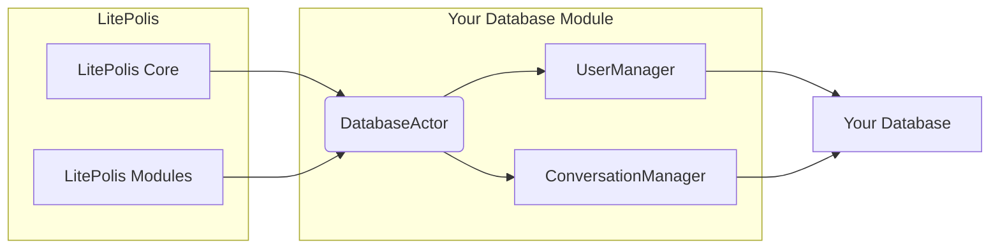

# LitePolis Database Template

This repository provides a template for creating custom database modules for the LitePolis system.

The example code within this template uses SQLModel and SQLite for demonstration purposes, **replace this specific implementation** with your chosen database technology (e.g., PostgreSQL, MySQL, MongoDB, Redis, etc.) and corresponding drivers or ORMs/ODMs (e.g., SQLAlchemy, Psycopg2, PyMongo, Django ORM, etc.).

## Key Files/Variables to Modify

*   **Folder:** `litepolis_database_template/` (Rename this)
*   **File:** `setup.py` (Update `name`, `version`, `install_requires`, etc.)
*   **File:** `requirements.txt` (Update dependencies)
*   **File:** `litepolis_database_template/utils.py` (Update `DEFAULT_CONFIG`, connection/session logic)
*   **File:** `litepolis_database_template/Actor.py` (Update `DatabaseActor` inheritance/implementation)
*   **File:** `litepolis_database_template/__init__.py` (Update imports)
*   **Files:** `litepolis_database_template/Users.py`, `Conversations.py` (Delete or replace these example files)
*   **Folder:** `tests/` (Rewrite tests)
*   **File:** `README.md` (Update prerequisites, add specific notes for your implementation)

## Steps

Follow these steps to adapt the template:

1.  **Clone Repository:** Get a local copy of this template.
2.  **Rename Package Folder:** Rename the `litepolis_database_template` directory to your desired package name (e.g., `litepolis_database_mymongodb`). This name should match the `name` you'll use in `setup.py`.
3.  **Update `setup.py`:** Modify the `name`, `version`, `author`, `description`, `url`, and especially `install_requires` to reflect your project and its dependencies.
4.  **Update `requirements.txt`:** List your project's dependencies, including the database driver/ORM. Remove `sqlmodel` if unused.
5.  **Install Dependencies:** Create a virtual environment and install the dependencies:
    ```bash
    python -m venv venv
    source venv/bin/activate # or venv\Scripts\activate on Windows
    pip install -r requirements.txt
    pip install -e . # Installs your package in editable mode
    ```
6.  **Configure Database (`litepolis_database_template/utils.py`):**
    *   Update `DEFAULT_CONFIG` with settings for your database.
    *   Implement the database connection logic (e.g., creating a client/engine).
    *   Implement session/connection handling functions suitable for your database.
    *   Adapt the configuration loading logic if necessary.
7.  **Define Data Models:**
    *   Delete the example model files (`Users.py`, `Conversations.py`).
    *   Create new Python files for your data models/schemas using your chosen tools.
8.  **Implement Database Logic:**
    *   Create "Manager" classes for your data models, containing methods for database operations (CRUD, queries, etc.).
    *   Update `litepolis_database_template/Actor.py` (`DatabaseActor`) to inherit from your new Manager classes. Remove the example inheritance.
9.  **Update `__init__.py`:** Modify the imports in `litepolis_database_template/__init__.py` to expose the necessary components from your module (your `DatabaseActor` and `DEFAULT_CONFIG` allow LitePolis to integrate your module).
10. **Write/Update Tests (`tests/`):**
    *   Delete or modify the existing test files (`test_Users.py`, etc.).
    *   Write new tests using `pytest` (or your preferred framework) to cover your database logic and models. Ensure proper test database setup/teardown.
    *   Run tests using `pytest`.
11. **Document Prerequisites:** Add any necessary setup instructions for your specific database to this README (e.g., "Requires a running PostgreSQL server accessible via connection string defined in config", "Ensure MongoDB is running on localhost:27017").
12. **Release:** Once developed and tested, you can package and release your module to PyPI using tools like `build` and `twine`.
    * Once your package is published on PyPI, LitePolis CLI will be able to download and install the package during setup of other administrators.

## Global Concepts to Retain

While changing the implementation, retain these structural concepts:

*   A central `DatabaseActor` class in `Actor.py` as the main entry point for LitePolis.
*   Using a configuration dictionary (`DEFAULT_CONFIG` in `utils.py`) for database settings.
*   Having dedicated logic for database connection and session/client management (`utils.py`).
*   Organizing database logic for different models into separate "Manager" classes (recommended).
*   Comprehensive testing using `pytest` (or equivalent) in the `tests/` directory.
*   Standard Python packaging via `setup.py`.

## Core Concepts




To adapt this template, you need to understand and modify the following key components:

1.  **`DatabaseActor` (`litepolis_database_template/Actor.py`):**
    *   **Important:** This class name `DatabaseActor` is the fixed entry point that LitePolis uses to interact with your database module.  **Do not rename this class.**
    *   This is the central class where you will implement your database logic.
    *   The template demonstrates a recommended pattern of using separate "Manager" classes for different data models/collections (e.g., `UserManager`, `ProductManager`) and having `DatabaseActor` inherit from them. This inheritance pattern is just a suggestion for code organization.
    *   **Alternative Implementations:** You are also free to implement `DatabaseActor` in other ways, such as by having it contain instances of manager classes as attributes, or by directly implementing all database logic within `DatabaseActor` itself.
    *   **Developer Manual is Key:** Regardless of the implementation approach you choose, it is crucial to provide clear documentation (e.g., in a developer manual or within the code itself) for downstream API developers. This documentation should explain how to interact with your `DatabaseActor` class and its methods to perform database operations.
    *   Replace the example `UserManager` and `ConversationManager` inheritance (or any other example structure) with your chosen implementation, ensuring you maintain the `DatabaseActor` class name.

2.  **Configuration (`litepolis_database_template/utils.py`):**
    *   The `DEFAULT_CONFIG` dictionary provides default connection settings. You **must** update this with configuration keys relevant to your chosen database (e.g., connection string, host, port, username, password, database name).
    *   The logic for retrieving the database configuration (checking `PYTEST_CURRENT_TEST` environment variable vs. defaults) should be adapted if your testing setup or configuration management differs.
    *   The `get_config` function (imported from `litepolis`) is used to potentially override defaults in production.

3.  **Database Connection & Session Management (`litepolis_database_template/utils.py`):**
    *   The example functions (`connect_db`, `create_db_and_tables`, `with_session`, `get_session`) and the `engine` creation are specific to SQLModel/SQLAlchemy.
    *   Replace this logic with the appropriate database technology and driver/ORM.

4.  **Data Models (e.g., `litepolis_database_template/Users.py`, `litepolis_database_template/Conversations.py`):**
    *   These files are **examples** demonstrating data models and manager classes using SQLModel.

5.  **Package Metadata (`setup.py`):**
    *   This file defines how your module is packaged. You **must** update:
        *   `name`: A unique name for your package (e.g., `litepolis-database-mymongodb`) must in pattern `litepolis-database-*`.
        *   `version`, `description`, `author`, `url`: Update with your details.
        *   `install_requires`: **Crucially**, list all dependencies required by your module, including the database driver (e.g., `pymongo`, `psycopg2-binary`, `redis`), any ORM/ODM, and other libraries. Remove `sqlmodel` if you are not using it.

6.  **Dependencies (`requirements.txt`):**
    *   This file lists dependencies for development and testing.

7.  **Testing (`tests/` folder):**
    *   The provided tests are specific to the SQLModel/SQLite example.
    *   Ensure your tests cover the methods implemented in your `DatabaseActor` and Manager classes.
