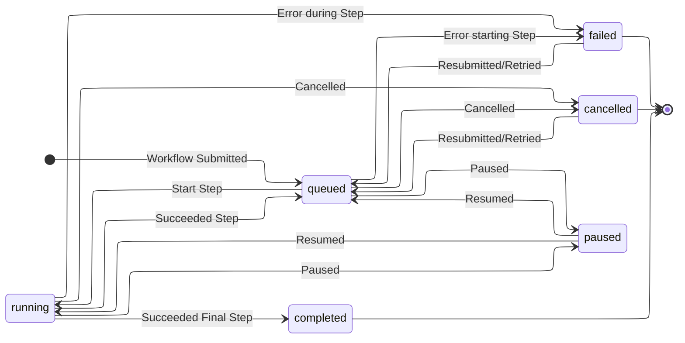

# MADSci Workcell Manager

The MADSci Workcell Manager handles the operation of a **Workcell**, a collection of **Nodes**, **Locations**, and **Resources** that are scheduled together to perform **Workflows**. A lab may consist of multiple Workcells, with each Workcell able to execute workflows independently.

## Defining a Workcell

You can create a new `WorkcellDefinition` file (typically a `.workcell.yaml`) using the command `madsci workcell create`

### Nodes

Nodes are required to execute the action required by each step in a Workflow. Each Node typically corresponds to a physical device (robot, instrument, sensor, etc.) in your laboratory.

In the workcell definition files `nodes` section, you can specify each node avaiable in the workcell as a mapping of node alias to the node's URL. When specifying the node to execute a step on in a Workflow, you should use the node alias defined here, rather than the node name according to the node itself.

### Locations

TODO

### Resources

TODO

## Defining Workflows

TODO

### Steps

TODO

### Checks

TODO

## Workflow Lifecycle

The below state diagrams illustrates the evolution of a Workflow's status over the course of it's life, from submission to reaching a terminal state.

## Usage

### Workcell Manager

### Workcell Client
