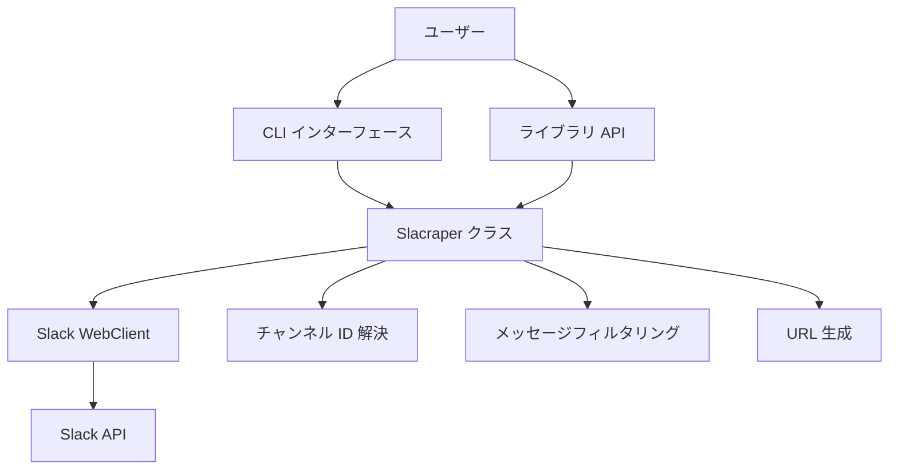

# System Patterns: slacraper

## システムアーキテクチャ

slacraper は、以下のコンポーネントで構成されています：

```
slacraper/
├── __init__.py  # パッケージ初期化とバージョン情報
├── core.py      # コア機能を提供する Slacraper クラス
└── cli.py       # コマンドラインインターフェース
```

### コンポーネント概要

1. **Slacraper クラス** (core.py)

   - Slack API との通信を担当
   - メッセージの取得とフィルタリングを実装
   - チャンネル ID の解決
   - ユーザー情報の取得
   - メッセージ URL の生成
   - ライブラリとしての主要インターフェース

2. **CLI インターフェース** (cli.py)
   - コマンドラインオプションの解析
   - 環境変数からのトークン読み取り
   - Slacraper クラスの呼び出し
   - エラーハンドリングと適切なエラーメッセージ
   - 結果の JSON 出力

## 重要な技術的決定

1. **slack-sdk の使用**

   - 公式の Slack SDK を使用して API との通信を行う
   - WebClient クラスを使用して REST API にアクセス
   - 標準的な API 呼び出しパターンを採用

2. **click の使用**

   - Python の標準的な CLI フレームワークとして click を採用
   - オプションの定義と解析を簡潔に記述
   - ヘルプメッセージの自動生成

3. **src-layout の採用**

   - Python パッケージの標準的なレイアウトとして src-layout を採用
   - テストとソースコードを明確に分離
   - パッケージのインストールと開発を容易に

4. **setuptools_scm の使用**

   - Git タグからバージョン番号を自動生成
   - バージョン管理を簡素化
   - 継続的デリバリーを容易に

5. **JSON 形式の採用**
   - 構造化されたデータ形式として JSON を採用
   - 他のツールとの連携を容易に
   - 人間にも読みやすい形式

## 設計パターン

1. **シングルレスポンシビリティ原則**

   - Slacraper クラスは Slack からのメッセージ取得に特化
   - CLI インターフェースはユーザー入力の処理と出力に特化
   - 各メソッドは単一の責任を持つように設計

2. **ファサードパターン**

   - Slacraper クラスは Slack API の複雑さを隠蔽し、シンプルなインターフェースを提供
   - 複雑な API 呼び出しを抽象化し、使いやすいメソッドを提供

3. **依存性注入**

   - トークンやチャンネル名などの設定を外部から注入
   - 環境変数からの設定読み取りをサポート
   - テスト容易性の向上

4. **コマンドパターン**

   - CLI インターフェースはコマンドパターンを採用
   - 各オプションは特定の動作を表現
   - 拡張性を考慮した設計

5. **フィルターパターン**
   - メッセージのフィルタリングに複数の条件を適用可能
   - 条件を組み合わせて柔軟なフィルタリングを実現
   - 将来的なフィルタリング条件の追加を容易に

## コンポーネント関係



### データフロー

1. **ライブラリ使用時**:

   ```
   ユーザーコード -> Slacraper -> チャンネル ID 解決 -> Slack API -> メッセージデータ取得 -> ユーザー情報取得 -> フィルタリング -> URL 生成（オプション） -> 構造化データ -> ユーザーコード
   ```

2. **CLI 使用時**:
   ```
   コマンドライン入力 -> オプション解析 -> 環境変数確認 -> Slacraper -> チャンネル ID 解決 -> Slack API -> メッセージデータ取得 -> ユーザー情報取得 -> フィルタリング -> URL 生成（オプション） -> 構造化データ -> JSON 出力
   ```

## エラーハンドリング戦略

1. **明示的な例外**

   - 明確なエラーメッセージを持つ例外を発生
   - API エラーを適切に変換して意味のあるエラーメッセージを提供

2. **段階的なエラー処理**

   - API レベルのエラーを捕捉して適切に処理
   - ユーザー入力のバリデーション
   - 環境変数の存在確認

3. **CLI でのエラー表示**
   - エラーメッセージを標準エラー出力に表示
   - 適切な終了コードを返す
   - トラブルシューティングのヒントを提供
